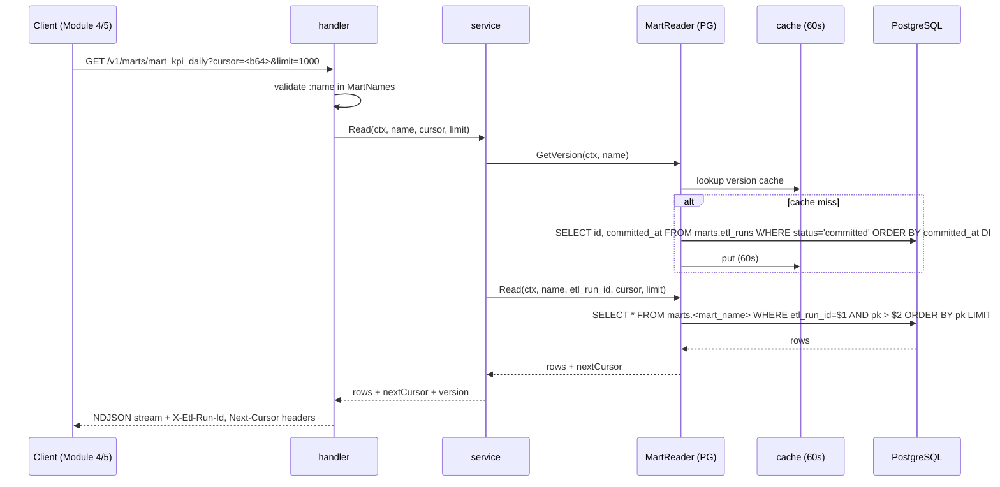

# Design: data-marts (Модуль 3)

```yaml
# Triage
tier: M
touches: {db: false, fe: false, infra: false, external: false}
risk: reversible
novelty: standard-crud
decisions:
  - cursor pagination strategy
  - cache layering
  - storage abstraction shape
  - mart name validation
```

## 1. Обзор

### Goals
- **Read-only API** поверх `marts.*` — стабильный контракт для потребителей (Модули 4 KPI, 5 Forecast).
- **Storage abstraction** (`MartReader`) — позволяет в будущем заменить PG на ClickHouse/Parquet/DuckDB.
- **Versioning** — клиент видит `etl_run_id` витрины через header `X-Etl-Run-Id` и/или endpoint `/version`.
- **Cache layer** — in-memory cache 60s TTL для часто запрашиваемых снимков.

### Non-goals (MVP)
- Filter expressions / SQL-like queries.
- Aggregations.
- Subscription/push API.
- Admin endpoints (CRUD над данными — это ответственность ETL).

## 2. Architecture

```
HTTP (Fiber v3 /v1/marts/*)
    │
    ▼
handler.* (один action = один файл)
    │
    ▼
service.Service ── MartReader (interface)
    │                   │
    │                   └─ reader_pg.PGReader (impl)
    │                          │
    │                          ▼
    │                  cache.LRUCache (60s TTL, key=(mart_name, etl_run_id))
    │                          │
    ▼                          ▼
repository.Repository ◄── pgxpool.Pool (тот же pool, что у data_export)
    │
    └─ go:embed *.sql
```

- `handler` — bind → service → response (NDJSON / JSON).
- `service` — оркестратор: вызывает MartReader (реализованный поверх repository + cache).
- `repository` — pgx + go:embed SQL.
- `MartReader` — публичный контракт абстракции (DI seam).

DI: один pool из `internal/app/app.go` (тот же что у data_export). Регистрация — добавляем `data_marts` Deps в `internal/routers/routers.go` (slim feature, встраивается в source-adapter binary, не отдельный binary).

## 3. Endpoints

| Method | Path | Roles | Описание |
|---|---|---|---|
| GET | `/v1/marts` | x-flow-etl OR it-read | Список доступных mart'ов + версии |
| GET | `/v1/marts/:name` | x-flow-etl OR it-read | NDJSON streaming строк mart'а с cursor pagination |
| GET | `/v1/marts/:name/version` | x-flow-etl OR it-read | Текущая версия (`etl_run_id`, `committed_at`) |
| GET | `/v1/marts/:name/schema` | x-flow-etl OR it-read | Schema витрины (поля + типы) |

### Sequence (Mermaid)



### DTOs (см. models/dto/)

```go
// MartInfoResponse — для GET /v1/marts
type MartInfoResponse struct {
    Marts []MartInfo `json:"marts"`
}
type MartInfo struct {
    Name        string `json:"name"`
    EtlRunID    string `json:"etl_run_id"`
    CommittedAt string `json:"committed_at"`
}

// MartVersionResponse — для GET /v1/marts/:name/version
type MartVersionResponse struct {
    Name        string `json:"name"`
    EtlRunID    string `json:"etl_run_id"`
    CommittedAt string `json:"committed_at"`
}

// MartSchemaResponse — для GET /v1/marts/:name/schema
type MartSchemaResponse struct {
    Name   string        `json:"name"`
    Fields []MartField   `json:"fields"`
}
type MartField struct {
    Name string `json:"name"`
    Type string `json:"type"` // text, numeric, date, timestamptz, jsonb, integer, boolean, uuid
}

// Для GET /v1/marts/:name — каждая строка NDJSON = map[string]any (raw row).
```

## 4. SQL queries (go:embed)

`internal/features/data_marts/sqls/queries/`:

| Файл | Назначение |
|---|---|
| `list_marts_versions.sql` | для каждой mart-таблицы — последний committed `etl_run_id` (UNION ALL по 5 mart'ам) |
| `current_version.sql` | `SELECT id, committed_at FROM marts.etl_runs WHERE status='committed' ORDER BY committed_at DESC LIMIT 1` |
| `select_mart_demand_history.sql` | cursor-page по `(product_id, location_id, as_of_date)` |
| `select_mart_calculation_input.sql` | cursor-page по `(product_id, location_id)` |
| `select_mart_kpi_daily.sql` | cursor-page по `(location_id, kpi_name, as_of_date)` |
| `select_mart_master_current.sql` | cursor-page по `(entity_type, entity_id)` |
| `select_mart_supplier_scorecard.sql` | cursor-page по `(supplier_id, week_start)` |

**Cursor strategy:** opaque base64(json{etl_run_id, last_pk}). Last_pk — конкатенация PK как `<f1>|<f2>|<f3>`. На странице фильтр `WHERE etl_run_id=$1 AND (f1, f2, f3) > ($2, $3, $4) ORDER BY f1, f2, f3 LIMIT $5`. ADR-001.

**Schema endpoint:** хардкод-таблица в `service/schemas.go` (контракт mart'ов фиксирован через миграцию Модуля 1). Не используем `information_schema` runtime — это лишний DB-call и runtime-coupling. ADR-002.

## 5. Errors

Используем существующие sentinel'ы из `pkg/errorspkg`:

| Sentinel | HTTP | Когда |
|---|---|---|
| `ErrBadRequest` | 400 | невалидный cursor / limit / mart name |
| `ErrUnauthorized` | 401 | нет JWT |
| `ErrForbidden` | 403 | роль не x-flow-etl/it-read |
| `ErrNotFound` | 404 | mart name не из whitelist'а ИЛИ нет committed run'а для mart'а |
| `ErrServiceUnavailable` | 503 | mart ещё не наполнен (нет committed run'а вообще) |
| `ErrInternal` | 500 | DB error |

**Новые sentinel'ы НЕ заводим** (KISS): `ErrNotFound.WithMessage("mart not found: <name>")` для unknown name; `ErrBadRequest.WithMessage("invalid cursor")` для bad cursor; `ErrServiceUnavailable.WithMessage("mart not yet populated")` для пустых mart'ов.

ADR-003 объясняет, почему не вводим feature-specific `ErrMartNotFound`/`ErrInvalidCursor` (есть generic, добавлять стоит только при реальной потребности маршрутизации в monitoring).

## 6. Tests

| Тип | Что покрываем | Файлы |
|---|---|---|
| Unit (handler) | happy path, bad cursor, mart not found, mart not ready, JWT/role gating через app.Test() | `handler/handler_test.go` |
| Unit (service) | cache hit/miss, mart name validation, error propagation | `service/service_test.go` + `service/cache_test.go` |
| Unit (repository) | SQL parse smoke (queries.MustGet) | `repository/repository_test.go` |
| Integration | repository поверх реального PG (postgres:18-alpine, dockertest/v3): создаём etl_run + 1 row в mart_demand_history → SelectRows возвращает её | `repository/repository_integration_test.go` (build tag integration) |

Coverage target: handler + service ≥80%. Integration test — 1 happy path для `mart_demand_history` (остальные 4 mart'а покрываются такой же кодовой структурой; CI время > безусловное покрытие).

## 7. ADR

### ADR-001: Cursor pagination — opaque base64(json{etl_run_id, pk})

**Driver:** клиенту нужна страничная пагинация без offset (offset на партиционированных mart'ах = sequential scan на каждый запрос). pk-based cursor работает за O(log n) на индексе PK.

**Альтернативы:**
- Offset/limit — отвергнут: O(n) на больших mart'ах.
- Server-side cursor (DECLARE) — отвергнут: stateful, плохо сочетается со statelessd API.
- Token + Redis state — отвергнут: лишняя инфраструктура, и cursor stateless легко регенерируется.

**Принято:** opaque base64(json{etl_run_id, last_pk}). Стиль идентичен `data_export.models.Cursor` — переиспользуем паттерн.

**Risks:** клиенты не должны парсить cursor (контракт opaque). Если меняем структуру — сохраняем backward-compat через version-byte.

### ADR-002: Schema endpoint — hardcoded в service/schemas.go (не information_schema)

**Driver:** schema витрин фиксирована миграцией Модуля 1. Runtime-чтение `information_schema` — extra DB-call для статичного значения + coupling между deploy DB и API.

**Альтернативы:**
- `information_schema.columns` runtime — лишний RTT + изменения схемы попадают в API без code review.
- Auto-generate из Go-типов через reflect — overengineering для 5 mart'ов.

**Принято:** `service/schemas.go` — `var Schemas = map[string][]MartField{...}`. Изменение требует PR + code review.

### ADR-003: Не вводим feature-specific sentinel'ы (ErrMartNotFound и т.д.)

**Driver:** YAGNI — generic ErrNotFound + WithMessage даёт ту же UX (мониторинг видит код 404 + сообщение). Заводим feature sentinel только когда нужна отдельная ветка alert'а.

**Альтернативы:**
- Завести `ErrMartNotFound` (404), `ErrInvalidMartCursor` (400), `ErrMartNotReady` (503) — отвергнуто: 3 новых sentinel'а ради 0 нового поведения.

**Принято:** generic + WithMessage. Если в будущем нужны feature alert rules → добавим в pkg/errorspkg.

### ADR-004: Cache TTL 60s, in-memory, key=(mart_name, etl_run_id)

**Driver:** ETL run меняется ~раз в час (из spec — daily/hourly cron). Cache горячих данных снижает DB load на N consumers × M paginations.

**Альтернативы:**
- Без cache — отвергнуто: каждый клиент дёргает `current_version` на каждой странице.
- Redis — отвергнуто: новая инфраструктура для slim feature, in-memory достаточно (один replica MVP).
- Cache-aside на 5 минут — отвергнуто: при cron каждые 60s данные могут быть stale.

**Принято:** sync.Map с TTL 60s. Метрика hit/miss на будущее (не в MVP).

**Risks:** при scale-out (>1 replica) — каждая реплика имеет свой cache. Это OK для read API: stale данные на ≤60s допустимы; consistency обеспечивается на уровне DB (etl_run_id).

### ADR-005: MartReader interface поверх repository — для будущей подмены storage

**Driver:** spec прямо требует abstraction для CH/Parquet будущих имплементаций.

**Альтернативы:**
- Сразу делать через repository без interface — отвергнуто: spec требует контракт.
- Interface в pkg/martstore — отвергнуто: pkg только для shared между фич; MartReader пока используется только тут.

**Принято:** `service.MartReader` interface + `service.PGReader` имплементация поверх `repository`. Перенос в pkg/martstore — когда появится 2+ имплементации.

## 8. Enums и константы

```go
// internal/features/data_marts/constants/marts.go
package constants

const (
    MartDemandHistory      = "mart_demand_history"
    MartCalculationInput   = "mart_calculation_input"
    MartKpiDaily           = "mart_kpi_daily"
    MartMasterCurrent      = "mart_master_current"
    MartSupplierScorecard  = "mart_supplier_scorecard"
)

var MartNames = []string{
    MartDemandHistory,
    MartCalculationInput,
    MartKpiDaily,
    MartMasterCurrent,
    MartSupplierScorecard,
}

const (
    LimitDefault = 1000
    LimitMax     = 10000
    CacheTTL     = 60 // seconds
)
```

## 9. Rollback

Этот модуль read-only без миграций. Откат = `git revert`. Никаких state-changes в БД, никаких background workers, никаких external integrations. `risk=reversible`.
