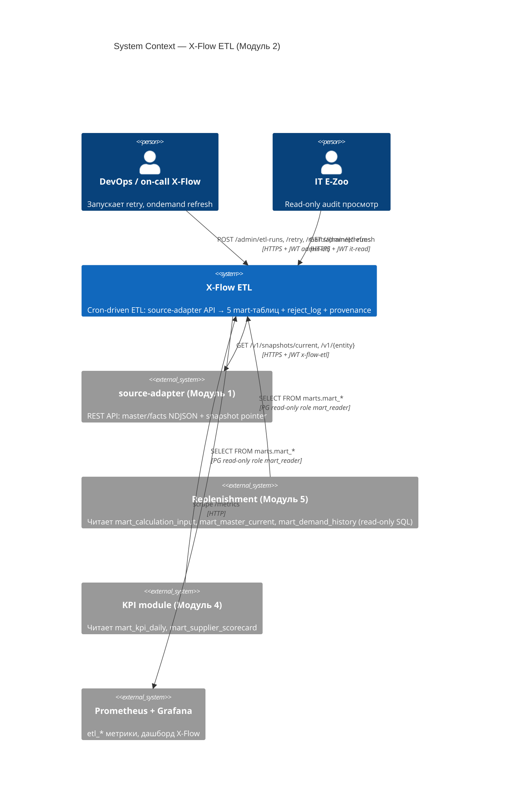
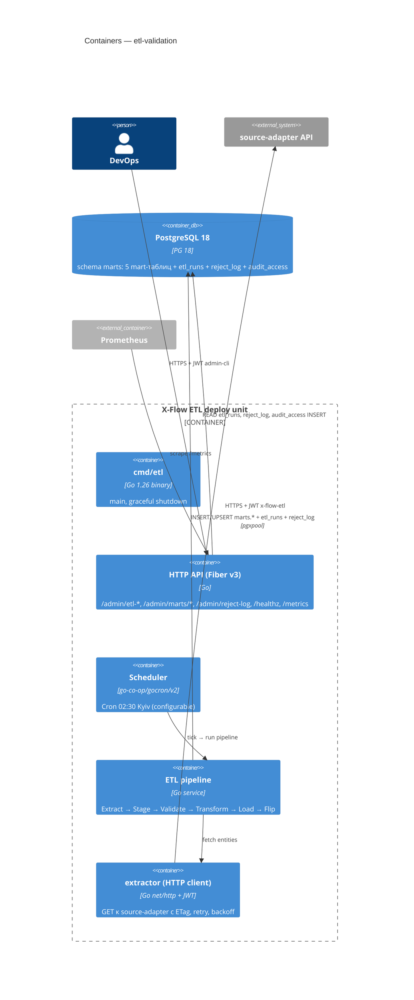
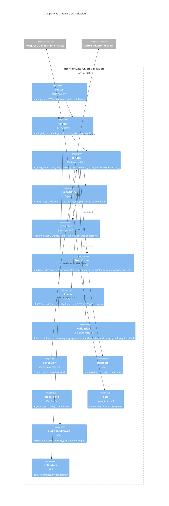
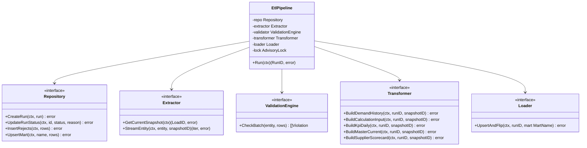
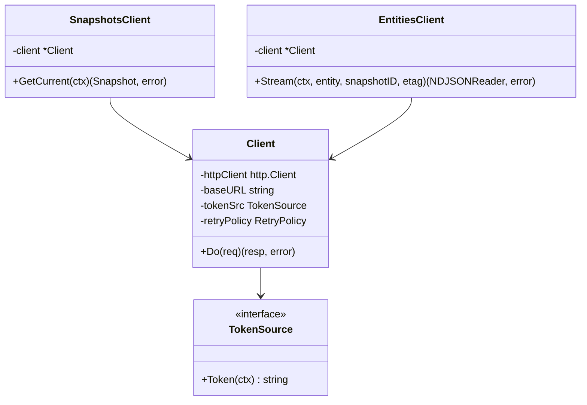
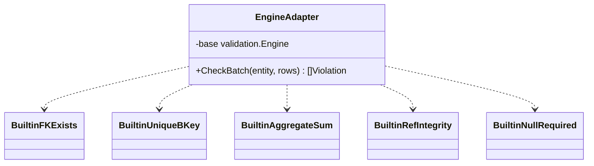

# Design C4 — etl-validation

C4 levels 1-4 для feature `etl_validation`. Все диаграммы Mermaid.

---

## L1 — System Context

---

## L2 — Container

---

## L3 — Components внутри `internal/features/etl_validation`

---

## L4 — Code (выборочные code-level блоки)

### 4.1. Pipeline orchestration (service/etl_pipeline.go)

### 4.2. extractor

### 4.3. validation (reuse Модуля 1)

> Engine движка из Модуля 1 (`internal/features/data_export/validation`) импортируется как библиотека. Builtin-чеки регистрируются адаптером.
