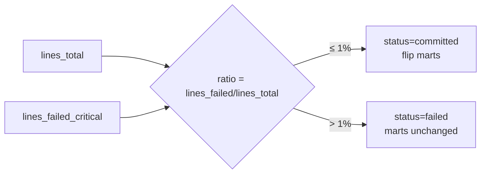
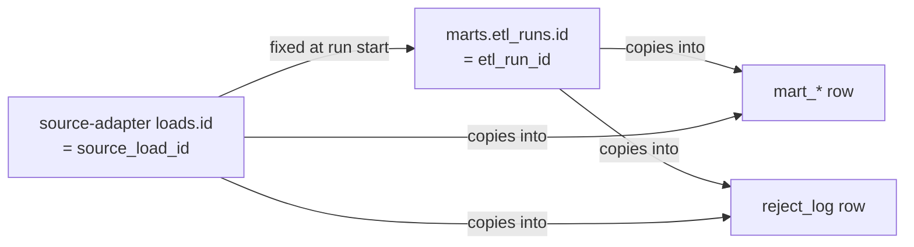
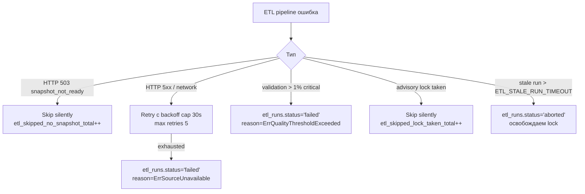
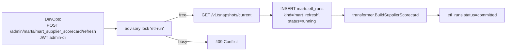

# Design Dataflow — etl-validation

Поток данных «cron tick → ETL pipeline → marts».

---

## 1. High-level dataflow

```mermaid
flowchart LR
    Cron[Scheduler<br/>gocron 02:30 Kyiv]
    Lock[(PG advisory lock<br/>hash 'etl-run')]
    Run[(marts.etl_runs<br/>status=running)]
    SAapi[source-adapter REST<br/>JWT x-flow-etl]
    Stage[(staging tables<br/>TEMP per run)]
    Engine[Validation engine<br/>YAML rules]
    Reject[(marts.reject_log)]
    Trans[Transformer<br/>SQL aggregation]
    Loader[Loader<br/>UPSERT + flip]
    Marts[(marts.mart_*)]
    Metrics[(Prometheus)]

    Cron --> Lock
    Lock -->|acquired| Run
    Run --> SAapi
    SAapi -->|GET /v1/snapshots/current| Run
    Run -->|fix source_load_id| SAapi
    SAapi -->|GET /v1/{entity}?snapshot=X<br/>NDJSON streaming, ETag| Stage
    Stage --> Engine
    Engine -->|critical| Reject
    Engine -->|soft| Reject
    Engine -->|all rows| Trans
    Trans -->|INSERT … SELECT| Loader
    Loader -->|atomic tx| Marts
    Loader -->|UPDATE status=committed| Run
    Run --> Metrics
    Reject --> Metrics
```

---

## 2. Pipeline stages (детально)

```mermaid
flowchart TB
    subgraph Stage1[1 - Extract]
        E1[GET /v1/snapshots/current → fix source_load_id]
        E2[GET /v1/products?snapshot=X]
        E3[GET /v1/locations?snapshot=X]
        E4[GET /v1/suppliers?snapshot=X]
        E5[GET /v1/order_rule?snapshot=X]
        E6[GET /v1/supply_spec?snapshot=X]
        E7[GET /v1/receipt_line?snapshot=X]
        E8[GET /v1/store_assortment?snapshot=X]
        E9[GET /v1/promo?snapshot=X]
    end

    subgraph Stage2[2 - Stage]
        S1[INSERT INTO stg_products]
        S2[INSERT INTO stg_locations]
        S3[INSERT INTO stg_suppliers]
        S4[INSERT INTO stg_order_rule]
        S5[INSERT INTO stg_supply_spec]
        S6[INSERT INTO stg_receipt_line]
        S7[INSERT INTO stg_store_assortment]
        S8[INSERT INTO stg_promo]
    end

    subgraph Stage3[3 - Validate]
        V1[fk_exists]
        V2[unique_business_key]
        V3[aggregate_sum_matches]
        V4[referential_integrity]
        V5[null_required_field]
        VR[Аккумулировать violations →<br/>severity per row]
    end

    subgraph Stage4[4 - Transform]
        T1[mart_demand_history<br/>агрегация receipt_line по дням]
        T2[mart_calculation_input<br/>resolve order_rule&gt;supply_spec]
        T3[mart_kpi_daily<br/>SUM revenue, OOS, transactions]
        T4[mart_master_current<br/>products+locations+suppliers]
        T5[mart_supplier_scorecard<br/>fill_rate, lead_time, OTIF]
    end

    subgraph Stage5[5 - Load + Flip]
        L1[BEGIN tx]
        L2[INSERT INTO mart_demand_history<br/>partition по as_of_date]
        L3[TRUNCATE+INSERT mart_calculation_input]
        L4[INSERT mart_kpi_daily partitioned]
        L5[TRUNCATE+INSERT mart_master_current]
        L6[INSERT mart_supplier_scorecard]
        L7[UPDATE etl_runs SET status='committed', committed_at=now]
        L8[COMMIT tx]
    end

    Stage1 --> Stage2 --> Stage3 --> Stage4 --> Stage5
    Stage3 -->|critical &gt; 1%| Failed[etl_runs.status='failed'<br/>marts NOT flip]
```



---

## 3. Quality gate (1% threshold)



ENV: `ETL_QUALITY_THRESHOLD_PCT=1.0` (configurable, ADR-015).

---

## 4. Provenance (etl_run_id + source_load_id)



Каждая строка mart_* и reject_log несёт `(etl_run_id, source_load_id)`. Это позволяет:
- Откатить (повторить) ровно тот же набор данных через `POST /admin/etl-runs/{id}/retry` (новый run, тот же source_load_id).
- Аудитить происхождение: «эта строка mart_calculation_input родилась в run X из source_load Y».

---

## 5. Backpressure / failure handling



---

## 6. Ondemand `mart_supplier_scorecard` refresh



> Q-021: только `mart_supplier_scorecard` поддерживает ondemand refresh. Для остальных mart-имён endpoint возвращает `ErrMartRefreshNotSupported` (HTTP 400).
