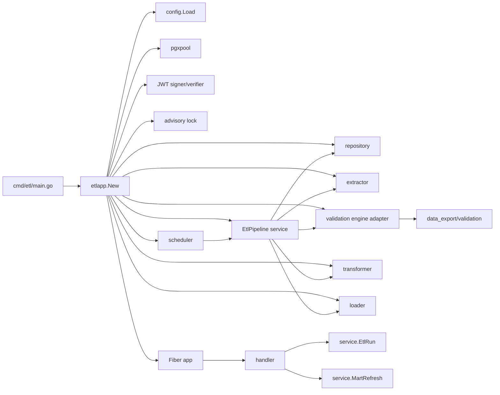

# Design DI (Dependency Injection) — etl-validation

> Бинарь `cmd/etl/main.go` имеет собственный «корень» — пакет `internal/etlapp`. Это аналог `internal/app` Модуля 1, но не делит с ним state. Это позволяет деплоить независимо.

---

## 1. cmd/etl/main.go

```go
package main

import (
    "context"
    "log/slog"
    "os"
    "os/signal"
    "syscall"

    "github.com/Kitavrus/e_zoo/internal/etlapp"
    "github.com/Kitavrus/e_zoo/internal/etlapp/config"
)

func main() {
    cfg, err := config.Load()
    if err != nil {
        slog.Error("config load failed", "err", err)
        os.Exit(1)
    }

    logger := slog.New(slog.NewJSONHandler(os.Stdout, &slog.HandlerOptions{
        Level: cfg.LogLevel,
    }))
    slog.SetDefault(logger)

    ctx, stop := signal.NotifyContext(context.Background(), os.Interrupt, syscall.SIGTERM)
    defer stop()

    application, err := etlapp.New(ctx, cfg, logger)
    if err != nil {
        slog.Error("etl app init failed", "err", err)
        os.Exit(1)
    }

    if err := application.Run(ctx); err != nil {
        slog.Error("etl app run failed", "err", err)
        os.Exit(1)
    }
}
```

> Полностью идентичный паттерн `cmd/source-adapter/main.go` (Модуль 1).

---

## 2. internal/etlapp/app.go

```go
package etlapp

import (
    "context"
    "errors"
    "log/slog"
    "net/http"
    "time"

    "github.com/gofiber/fiber/v3"
    "github.com/jackc/pgx/v5/pgxpool"

    "github.com/Kitavrus/e_zoo/internal/etlapp/config"
    "github.com/Kitavrus/e_zoo/internal/etlapp/deps"
    "github.com/Kitavrus/e_zoo/internal/middleware/jwt"
    "github.com/Kitavrus/e_zoo/internal/middleware/role"
    "github.com/Kitavrus/e_zoo/internal/features/etl_validation/extractor"
    "github.com/Kitavrus/e_zoo/internal/features/etl_validation/handler"
    "github.com/Kitavrus/e_zoo/internal/features/etl_validation/loader"
    "github.com/Kitavrus/e_zoo/internal/features/etl_validation/repository"
    "github.com/Kitavrus/e_zoo/internal/features/etl_validation/router"
    "github.com/Kitavrus/e_zoo/internal/features/etl_validation/scheduler"
    "github.com/Kitavrus/e_zoo/internal/features/etl_validation/service"
    "github.com/Kitavrus/e_zoo/internal/features/etl_validation/transformer"
    "github.com/Kitavrus/e_zoo/internal/features/etl_validation/validation"
    saValidation "github.com/Kitavrus/e_zoo/internal/features/data_export/validation"
)

type App struct {
    cfg        config.Config
    logger     *slog.Logger
    pool       *pgxpool.Pool
    fiber      *fiber.App
    metrics    *http.Server
    sched      *scheduler.Scheduler
    pipeline   service.EtlPipeline
}

func New(ctx context.Context, cfg config.Config, logger *slog.Logger) (*App, error) {
    pool, err := deps.NewPgxPool(ctx, cfg.DBDSN)
    if err != nil { return nil, err }

    repo := repository.New(pool)

    // JWT signer / verifier (HS256 default)
    jwtSigner, err := deps.NewJWTSigner(cfg.JWT)
    if err != nil { return nil, err }
    jwtVerifier, err := deps.NewJWTVerifier(cfg.JWT)
    if err != nil { return nil, err }

    // Extractor: HTTP-клиент к source-adapter API
    httpClient := deps.NewHTTPClient(cfg.HTTPTimeout)
    ext := extractor.New(extractor.Config{
        BaseURL:        cfg.APIBaseURL,
        TokenSrc:       extractor.NewJWTTokenSource(jwtSigner, "x-flow-etl"),
        Client:         httpClient,
        RetryMax:       cfg.RetryMax,
        RetryBackoffCap: cfg.RetryBackoffCap,
    })

    // Validation engine reuse (импорт пакета Модуля 1)
    saEng, err := saValidation.Load(cfg.ValidationRulesPath)
    if err != nil { return nil, err }
    valEng := validation.NewAdapter(saEng, repo) // регистрирует ETL-builtin-чеки

    // Transformer / Loader
    trans := transformer.New(repo)
    ld := loader.New(pool, repo)

    // Advisory lock + scheduler
    lock := scheduler.NewAdvisoryLock(pool)
    pipeline := service.NewEtlPipeline(repo, ext, valEng, trans, ld, lock, logger, cfg)
    sched := scheduler.New(cfg.CronSchedule, cfg.TZ, pipeline, logger, cfg.StaleRunTimeout)

    // Fiber app + middlewares
    fiberApp := fiber.New(fiber.Config{...})
    auth := jwt.NewMiddleware(jwtVerifier)
    audit := deps.NewAuditMiddleware(repo)

    martRefreshSvc := service.NewMartRefresh(pipeline)
    etlRunSvc := service.NewEtlRun(repo, pipeline)

    deps.RegisterRoutes(fiberApp, router.Deps{
        EtlRunSvc:        etlRunSvc,
        MartRefreshSvc:   martRefreshSvc,
        Repo:             repo,
        AuthAdmin:        role.Require("admin-cli"),
        AuthAdminOrRead:  role.RequireAny("admin-cli", "it-read"),
        JWT:              auth,
        Audit:            audit,
        Logger:           logger,
    })

    // Metrics on separate port
    metricsSrv := deps.NewMetricsServer(cfg.MetricsAddr)

    return &App{
        cfg: cfg, logger: logger, pool: pool, fiber: fiberApp,
        metrics: metricsSrv, sched: sched, pipeline: pipeline,
    }, nil
}

func (a *App) Run(ctx context.Context) error {
    g, ctx := errgroup.WithContext(ctx)
    g.Go(func() error { return a.fiber.Listen(a.cfg.HTTPAddr) })
    g.Go(func() error { return a.metrics.ListenAndServe() })
    g.Go(func() error { return a.sched.Start(ctx) })

    <-ctx.Done()
    a.logger.Info("shutdown initiated")

    shutdownCtx, cancel := context.WithTimeout(context.Background(), 30*time.Second)
    defer cancel()

    _ = a.fiber.ShutdownWithContext(shutdownCtx)
    _ = a.metrics.Shutdown(shutdownCtx)
    _ = a.sched.Stop(shutdownCtx)
    a.pool.Close()

    return g.Wait()
}
```

---

## 3. internal/etlapp/config/config.go

```go
package config

import (
    "log/slog"
    "time"

    "github.com/kelseyhightower/envconfig"
)

type JWT struct {
    Algorithm    string `envconfig:"JWT_ALG" default:"HS256"`
    SigningKey   string `envconfig:"JWT_SIGNING_KEY"`
    PublicKeyPath string `envconfig:"JWT_PUBLIC_KEY_PATH"`
    Issuer       string `envconfig:"JWT_ISSUER" default:"x-flow-etl"`
    Audience     string `envconfig:"JWT_AUDIENCE" default:"source-adapter"`
}

type Config struct {
    HTTPAddr             string        `envconfig:"HTTP_ADDR" default:":8081"`
    MetricsAddr          string        `envconfig:"METRICS_ADDR" default:":9091"`
    LogLevel             slog.Level    `envconfig:"LOG_LEVEL" default:"info"`

    DBDSN                string        `envconfig:"DB_DSN" required:"true"`

    APIBaseURL           string        `envconfig:"API_BASE_URL" default:"http://source-adapter:8080"`
    HTTPTimeout          time.Duration `envconfig:"HTTP_TIMEOUT" default:"30s"`
    RetryMax             int           `envconfig:"RETRY_MAX" default:"5"`
    RetryBackoffCap      time.Duration `envconfig:"RETRY_BACKOFF_CAP" default:"30s"`

    CronSchedule         string        `envconfig:"CRON_SCHEDULE" default:"30 2 * * *"`
    TZ                   string        `envconfig:"TZ" default:"Europe/Kyiv"`
    StaleRunTimeout      time.Duration `envconfig:"STALE_RUN_TIMEOUT" default:"1h"`
    QualityThresholdPct  float64       `envconfig:"QUALITY_THRESHOLD_PCT" default:"1.0"`

    ValidationRulesPath  string        `envconfig:"VALIDATION_RULES_PATH" default:"/app/configs/etl_validation_rules.yaml"`

    JWT JWT
}

func Load() (Config, error) {
    var cfg Config
    if err := envconfig.Process("ETL", &cfg); err != nil { return Config{}, err }
    return cfg, nil
}
```

> Все env-vars используют префикс `ETL_*` (см. [design-infrastructure.md](design-infrastructure.md) §2).

---

## 4. internal/etlapp/deps/deps.go

```go
package deps

import (
    "context"
    "net/http"
    "time"

    "github.com/jackc/pgx/v5/pgxpool"
)

func NewPgxPool(ctx context.Context, dsn string) (*pgxpool.Pool, error) {
    cfg, err := pgxpool.ParseConfig(dsn)
    if err != nil { return nil, err }
    cfg.MaxConns = 16
    cfg.MinConns = 2
    cfg.MaxConnLifetime = time.Hour
    cfg.HealthCheckPeriod = time.Minute
    return pgxpool.NewWithConfig(ctx, cfg)
}

func NewHTTPClient(timeout time.Duration) *http.Client {
    return &http.Client{
        Timeout: timeout,
        Transport: &http.Transport{
            MaxIdleConns:        50,
            MaxIdleConnsPerHost: 10,
            IdleConnTimeout:     90 * time.Second,
        },
    }
}
```

---

## 5. Граф зависимостей



> Никаких циклов. Все интерфейсы определены в потребляющем пакете (handler / service / etc.).

---

## 6. Lifecycle

1. `main` → `etlapp.New(ctx, cfg, logger)`:
   - открывает pool, поднимает Fiber, регистрирует routes, стартует scheduler.
2. `app.Run(ctx)`:
   - `errgroup` пускает: HTTP server, metrics server, scheduler.
3. SIGTERM/SIGINT:
   - `signal.NotifyContext` → `ctx.Done()`.
   - `app.Run` останавливает Fiber (graceful), metrics, scheduler.
   - Закрывает pool.
   - Возврат из `Run` → `main` exit 0.

---

## 7. Зачем отдельный `etlapp`, а не общий `app`

- Бинари `source-adapter` и `etl` имеют разные SLA, разные cron-tasks, разные routes.
- Шеринг Fiber-роутов через один процесс смешивает аудит и retention двух ответственностей.
- `etlapp` импортирует Модуль 1 *как библиотеку* (validation engine, errorspkg, middleware), но не пытается жить «внутри» него.
- Это упрощает и тесты: pipeline-тест поднимает только `etlapp`, без всех routes Модуля 1.
