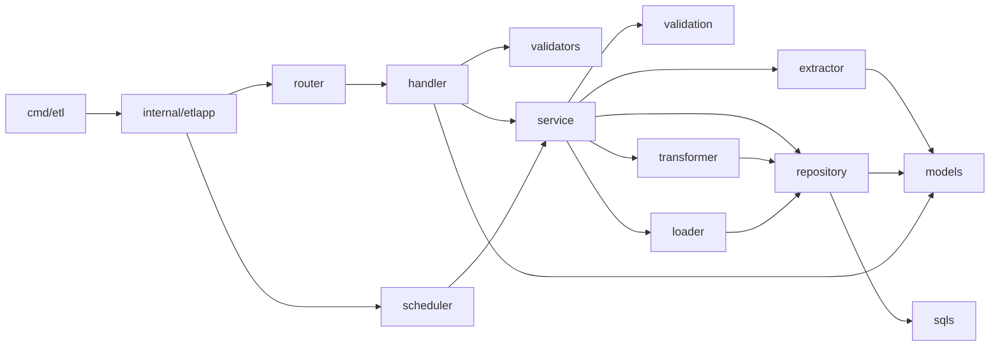

# Design Go Layers — etl-validation

> Module path: `github.com/Kitavrus/e_zoo`. Все типы — пакет уровня feature `internal/features/etl_validation/...`. DI-склейка — `internal/etlapp/`.

---

## 1. Дерево feature

```
cmd/etl/
└── main.go                                    # graceful shutdown, как cmd/source-adapter/main.go

internal/etlapp/
├── app.go                                     # New(ctx,cfg,logger) → *App; (a *App) Run(ctx)
├── config/
│   └── config.go                              # envconfig prefix ETL_*
└── deps/
    └── deps.go                                # bootstrap pgxpool, jwtSigner, httpClient

internal/features/etl_validation/
├── handler/
│   ├── admin_etl_runs.go                      # POST /admin/etl-runs, /retry, GET /{id}, GET list
│   ├── admin_marts.go                         # POST /admin/marts/{name}/refresh
│   ├── admin_reject_log.go                    # GET /admin/reject-log
│   └── healthz.go                             # GET /healthz
├── service/
│   ├── etl_run.go                             # бизнес-логика admin endpoints
│   ├── etl_pipeline.go                        # Run pipeline orchestration
│   └── mart_refresh.go                        # ondemand refresh
├── repository/
│   ├── etl_runs.go
│   ├── reject_log.go
│   ├── audit_access.go
│   ├── marts.go                               # UPSERT/INSERT в mart_*
│   └── staging.go                             # CREATE TEMP TABLE + bulk insert
├── extractor/
│   ├── client.go                              # net/http client + retry/backoff
│   ├── snapshots.go                           # SnapshotsClient
│   ├── entities.go                            # EntitiesClient (NDJSON streaming + ETag)
│   └── token_source.go                        # JWT signer (HS256/RS256)
├── transformer/
│   ├── demand_history.go
│   ├── calculation_input.go
│   ├── kpi_daily.go
│   ├── master_current.go
│   └── supplier_scorecard.go
├── loader/
│   ├── upsert.go
│   └── flip.go                                # один tx: INSERT + UPDATE etl_runs
├── validation/
│   ├── engine_adapter.go                      # обёртка над data_export/validation
│   ├── builtin_fk_exists.go
│   ├── builtin_unique_bkey.go
│   ├── builtin_aggregate_sum.go
│   ├── builtin_ref_integrity.go
│   └── builtin_null_required.go
├── validators/
│   └── admin_request.go                       # формат-валидация HTTP DTO
├── scheduler/
│   ├── cron.go                                # gocron scheduler
│   └── lock.go                                # advisory lock helper
├── models/
│   ├── etl_run.go
│   ├── reject.go
│   ├── mart_demand_history.go
│   ├── mart_calculation_input.go
│   ├── mart_kpi_daily.go
│   ├── mart_master_current.go
│   ├── mart_supplier_scorecard.go
│   └── dto/
│       ├── admin_etl_run_request.go
│       ├── admin_etl_run_response.go
│       └── admin_mart_refresh.go
├── mappers/
│   ├── source_dto_to_domain.go
│   └── domain_to_mart.go
├── router/
│   └── router.go                              # Register(app, deps)
└── sqls/
    ├── queries/
    │   ├── etl_runs_insert.sql
    │   ├── etl_runs_update_status.sql
    │   ├── etl_runs_get_by_id.sql
    │   ├── etl_runs_list.sql
    │   ├── reject_log_insert.sql
    │   ├── reject_log_select.sql
    │   ├── mart_demand_history_insert.sql
    │   ├── mart_calculation_input_truncate_insert.sql
    │   ├── mart_kpi_daily_insert.sql
    │   ├── mart_master_current_truncate_insert.sql
    │   ├── mart_supplier_scorecard_insert.sql
    │   └── audit_access_insert.sql
    └── migrations/
        ├── 1001_marts_schema.up.sql
        ├── 1001_marts_schema.down.sql
        ├── 1002_etl_runs.up.sql
        └── 1002_etl_runs.down.sql

configs/
└── etl_validation_rules.yaml                  # стартовый набор правил
```

---

## 2. Ключевые интерфейсы

### 2.1. `Repository` (composite)

```go
package repository

type Repository interface {
    EtlRunRepository
    RejectLogRepository
    MartRepository
    AuditAccessRepository
    StagingRepository
}

type EtlRunRepository interface {
    Create(ctx context.Context, run models.EtlRun) error
    UpdateStatus(ctx context.Context, id uuid.UUID, status string, reason string) error
    UpdateSourceLoadID(ctx context.Context, id uuid.UUID, loadID uuid.UUID) error
    UpdateMartsSummary(ctx context.Context, id uuid.UUID, summary models.MartsSummary) error
    GetByID(ctx context.Context, id uuid.UUID) (models.EtlRun, error)
    List(ctx context.Context, filter models.EtlRunFilter) ([]models.EtlRun, string, error)
    GetActive(ctx context.Context) (models.EtlRun, error) // возвращает running, либо ErrEtlRunNotFound
}

type RejectLogRepository interface {
    InsertBatch(ctx context.Context, rows []models.Reject) error
    List(ctx context.Context, filter models.RejectFilter) ([]models.Reject, string, error)
}

type MartRepository interface {
    UpsertDemandHistory(ctx context.Context, tx pgx.Tx, runID, sourceLoadID uuid.UUID) (int64, error)
    RebuildCalculationInput(ctx context.Context, tx pgx.Tx, runID, sourceLoadID uuid.UUID) (int64, error)
    UpsertKpiDaily(ctx context.Context, tx pgx.Tx, runID, sourceLoadID uuid.UUID) (int64, error)
    RebuildMasterCurrent(ctx context.Context, tx pgx.Tx, runID, sourceLoadID uuid.UUID) (int64, error)
    UpsertSupplierScorecard(ctx context.Context, tx pgx.Tx, runID, sourceLoadID uuid.UUID) (int64, error)
}

type AuditAccessRepository interface {
    Insert(ctx context.Context, ev models.AuditAccess) error
}

type StagingRepository interface {
    CreateAll(ctx context.Context, tx pgx.Tx) error // CREATE TEMP TABLE stg_*
    BulkInsert(ctx context.Context, tx pgx.Tx, entity string, rows []map[string]any) (int64, error)
    DropAll(ctx context.Context, tx pgx.Tx) error
}
```

### 2.2. `Extractor`

```go
package extractor

type Extractor interface {
    GetCurrentSnapshot(ctx context.Context) (Snapshot, error)
    StreamEntity(ctx context.Context, entity string, snapshotID uuid.UUID, etag string) (NDJSONReader, error)
}

type Snapshot struct {
    CurrentLoadID uuid.UUID
    CommittedAt   time.Time
}

type NDJSONReader interface {
    io.Closer
    // Next() decodes the next row into target; returns io.EOF when done.
    Next(target any) error
    ETag() string
}
```

### 2.3. `ValidationEngine`

```go
package validation

type Engine interface {
    CheckBatch(ctx context.Context, entity string, rows []map[string]any) []Violation
    IsEntityOptional(entity string) bool
}

type Violation struct {
    RuleID   string
    Entity   string
    Field    string
    Severity Severity // critical | soft
    Message  string
    Key      string  // business key (if relevant)
}
```

> Реализация — `engine_adapter.go`: оборачивает `internal/features/data_export/validation.Engine` (импортируется как библиотечный пакет) и регистрирует пять ETL-builtin-чеков.

### 2.4. `Transformer`

```go
package transformer

type Transformer interface {
    BuildDemandHistory(ctx context.Context, tx pgx.Tx, runID, sourceLoadID uuid.UUID) (rowsInserted int64, err error)
    BuildCalculationInput(ctx context.Context, tx pgx.Tx, runID, sourceLoadID uuid.UUID) (rowsInserted int64, err error)
    BuildKpiDaily(ctx context.Context, tx pgx.Tx, runID, sourceLoadID uuid.UUID) (rowsInserted int64, err error)
    BuildMasterCurrent(ctx context.Context, tx pgx.Tx, runID, sourceLoadID uuid.UUID) (rowsInserted int64, err error)
    BuildSupplierScorecard(ctx context.Context, tx pgx.Tx, runID, sourceLoadID uuid.UUID) (rowsInserted int64, err error)
}
```

### 2.5. `Loader`

```go
package loader

type Loader interface {
    // UpsertAndFlip выполняет вставку в mart_<name> и обновление etl_runs в одной транзакции.
    UpsertAndFlip(ctx context.Context, runID, sourceLoadID uuid.UUID, mart MartName) (rows int64, err error)
}

type MartName string

const (
    MartDemandHistory      MartName = "mart_demand_history"
    MartCalculationInput   MartName = "mart_calculation_input"
    MartKpiDaily           MartName = "mart_kpi_daily"
    MartMasterCurrent      MartName = "mart_master_current"
    MartSupplierScorecard  MartName = "mart_supplier_scorecard"
)
```

### 2.6. `AdvisoryLock`

```go
package scheduler

type AdvisoryLock interface {
    TryLock(ctx context.Context, key string) (acquired bool, release func(context.Context) error, err error)
    DetectStale(ctx context.Context, threshold time.Duration) (staleRunID uuid.UUID, ok bool, err error)
}
```

> Реализация: `pg_try_advisory_lock(hashtext($1))` через pgxpool. `DetectStale` сканирует `etl_runs` со `status='running'` и `started_at < now() - threshold`.

### 2.7. `EtlPipeline` (service-уровень)

```go
package service

type EtlPipeline interface {
    // Run полностью выполняет ETL run (extract → validate → transform → load → flip).
    // Возвращает runID. Используется crom + admin endpoint.
    Run(ctx context.Context, opts RunOptions) (uuid.UUID, error)
    // RunRefresh выполняет ondemand refresh одной mart-таблицы.
    RunRefresh(ctx context.Context, mart loader.MartName) (uuid.UUID, error)
}

type RunOptions struct {
    Trigger        string    // "cron" | "admin" | "retry"
    RetryOf        *uuid.UUID
    FixedSnapshot  *uuid.UUID // для retry
    Requester      string     // JWT sub
}
```

---

## 3. Слои и зависимости (Acyclic graph)



**Запреты:**
- `repository → service` запрещено.
- `handler → repository` запрещено (только через service).
- `transformer/loader → handler` запрещено.
- `models → service|handler|repository` запрещено (модели «голые»).

---

## 4. Контракты ошибок

Sentinel-ошибки живут в `pkg/errorspkg` (расширяем — см. [design-errors.md](design-errors.md)). HTTP-mapping inline в handler через `errorspkg.WriteJSON(c, err)` — отдельного `mappers/errors.go` нет.

---

## 5. Re-use из Модуля 1

| Что | Откуда | Способ |
|---|---|---|
| `*errorspkg.Error` + `WriteJSON` | `pkg/errorspkg` | прямой импорт |
| JWT middleware | `internal/middleware/jwt` | прямой импорт |
| Role middleware | `internal/middleware/role` | прямой импорт |
| Logger | `pkg/logger` | прямой импорт |
| Validation engine (severity) | `internal/features/data_export/validation` | прямой импорт как библиотека |
| dockertest suite | `pkg/dockertestpkg` | прямой импорт |

---

## 6. Конфиги

`configs/etl_validation_rules.yaml` (см. `design.md` §6) — путь читает `etlapp/config.go` через env `ETL_VALIDATION_RULES_PATH` (default `./configs/etl_validation_rules.yaml`).
