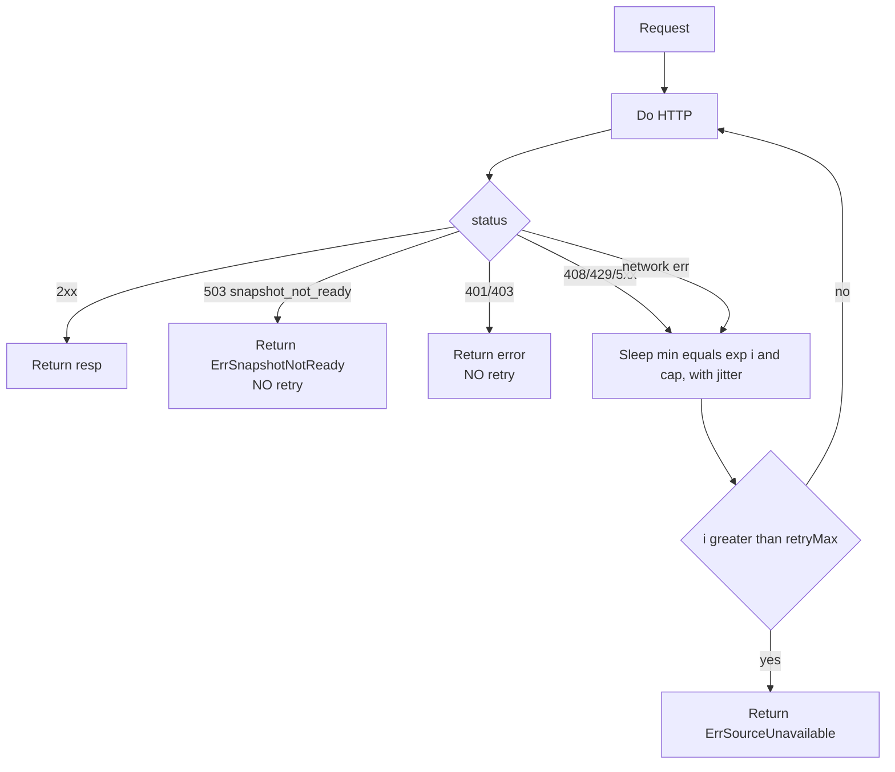
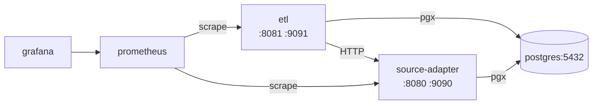

# Design Integrations — etl-validation

> Внешние интеграции Модуля 2: source-adapter REST API, JWT, slog, Prometheus/Grafana, PostgreSQL.

---

## 1. HTTP-клиент к source-adapter API (`extractor/`)

### 1.1. Стек
- `net/http` (без сторонних HTTP-клиентов, ADR-100).
- JWT bearer токены (`x-flow-etl` role).
- ETag / `If-None-Match` для re-fetch оптимизации.
- Retry с экспоненциальным backoff, cap 30s (env `ETL_RETRY_BACKOFF_CAP`).

### 1.2. Endpoints, к которым ходим

| Метод | Путь (source-adapter) | Когда |
|---|---|---|
| `GET /v1/snapshots/current` | начало ETL run (atomic snapshot read) |
| `GET /v1/{entity}?snapshot=<load_id>` | для каждой нужной сущности |

Список сущностей, читаемых ETL: `products`, `locations`, `suppliers`, `order_rule`, `supply_spec`, `receipt_line`, `store_assortment`, `promo`, `stock_on_hand`, `receiving_details`, `master_change_log`. Уточняется при имплементации Модуля 5.

### 1.3. Контракт `extractor.Client`

```go
type Client struct {
    httpClient   *http.Client
    baseURL      string
    tokenSrc     TokenSource
    retryMax     int
    backoffCap   time.Duration
}

type TokenSource interface { Token(ctx context.Context) (string, error) }

func (c *Client) Do(ctx context.Context, req *http.Request) (*http.Response, error) {
    tok, _ := c.tokenSrc.Token(ctx)
    req.Header.Set("Authorization", "Bearer "+tok)
    req.Header.Set("Accept", "application/x-ndjson")
    return c.doWithRetry(ctx, req)
}
```

### 1.4. Retry policy



- Базовый `min(2^i × 200ms, 30s)`, jitter ±20%.
- `retryMax = 5` (default), configurable.

### 1.5. ETag

- Каждый ответ от source-adapter содержит ETag (header).
- Клиент кеширует ETag *в памяти* за `(entity, snapshot_load_id)` ключом, но в рамках одного run-а нам не нужно повторять — сохраняется для следующего run-а только если он использует тот же `source_load_id` (ситуация retry).
- При retry используем `If-None-Match`. 304 → клиент возвращает специальный `ErrNotModified`, и pipeline переиспользует staging данные предыдущего run-а (если есть). MVP: при retry мы всё-таки полностью перечитываем — ETag используется *для метрик кэш-хитов*, не для skip-логики.

### 1.6. NDJSON streaming

```go
type NDJSONReader interface {
    io.Closer
    Next(target any) error  // io.EOF когда поток закончен
    ETag() string
}
```

- Внутри: `bufio.Scanner` с increased buffer 1 MiB, JSON unmarshal каждой строки.
- Backpressure: `EntitiesClient.Stream` возвращает reader, pipeline тянет батчами (1024 row) в staging.

---

## 2. JWT

### 2.1. Подпись (issuer-side, для запросов к source-adapter)

- `ETL_JWT_ALG` ∈ {`HS256`, `RS256`} (default `HS256`).
- HS256: `ETL_JWT_SIGNING_KEY` (env hex/base64).
- RS256: `ETL_JWT_PUBLIC_KEY_PATH` + `ETL_JWT_PRIVATE_KEY_PATH`.
- Claims: `{iss: "x-flow-etl", aud: "source-adapter", role: "x-flow-etl", sub: "etl-bot", iat, exp}`.
- `exp = now() + 5m` (короткий срок), новый токен на каждый retry-цикл.

### 2.2. Верификация (server-side, для admin endpoint-ов ETL)

- Те же два режима, ENV префикс `ETL_JWT_*`.
- Поддерживаемые роли: `admin-cli`, `it-read` (см. таблицу endpoints в `design.md`).
- Используется reuse `internal/middleware/jwt` + `internal/middleware/role` Модуля 1.

---

## 3. Logger (slog JSON)

- Reuse `pkg/logger`. Корневой logger создаётся в `cmd/etl/main.go`.
- Контекстные поля: `request_id`, `etl_run_id`, `source_load_id`, `entity`, `mart`, `status_code`, `duration_ms`, `requester` (JWT sub).
- Уровни: `debug` (per-row violation), `info` (run start/end, mart commit), `warn` (retry, soft violations), `error` (failed run, network errors).

---

## 4. Prometheus метрики

### 4.1. Список метрик (Q-009 / ADR-009)

| Метрика | Тип | Labels | Когда |
|---|---|---|---|
| `etl_run_duration_seconds` | Histogram | `result=committed/failed/aborted` | при завершении run |
| `etl_run_success_total` | Counter | — | при committed |
| `etl_run_failed_total` | Counter | `reason=quality/source_unavailable/snapshot_not_ready/internal` | при failed |
| `etl_skipped_lock_taken_total` | Counter | — | tick + lock busy |
| `etl_skipped_no_snapshot_total` | Counter | — | tick + 503 snapshot_not_ready |
| `etl_lines_processed_total` | Counter | `entity` | per stage |
| `etl_lines_failed_total` | Counter | `entity, severity` | per stage |
| `etl_lag_seconds` | Gauge | — | now - etl_runs.committed_at |
| `mart_rows_total` | Gauge | `mart` | после commit |
| `etl_extractor_request_seconds` | Histogram | `entity, code` | per HTTP call |
| `etl_extractor_retries_total` | Counter | `entity, reason` | per retry |
| `etl_advisory_lock_held_seconds` | Gauge | — | пока run работает |

### 4.2. /metrics

- Отдельный port `:9091` (env `ETL_METRICS_ADDR`).
- `promhttp.Handler()`, без аутентификации внутри VPC.
- Если deploy наружу — basic-auth через nginx.

### 4.3. Grafana

- Расширение существующего дашборда X-Flow (Модуль 1) новой секцией «X-Flow ETL»:
  - panel: ETL run duration p50/p95/p99 (за 7 дней).
  - panel: success/failed/skipped per day.
  - panel: lines_failed / lines_total (доля).
  - panel: mart_rows_total (per mart).
  - panel: etl_lag_seconds (последний committed_at).
  - alert: `etl_lag_seconds > 4 * 3600` (>4h без commit).
  - alert: `etl_run_failed_total{reason="quality"}` increase > 0 за 1d.
  - alert: `up{job="etl"} == 0` 5m.

---

## 5. PostgreSQL

- pgx/v5 + pgxpool (reuse паттерна Модуля 1).
- ConnString через env `ETL_DB_DSN` (можно общий `DB_DSN` если оба бинаря на одном кластере).
- pool: `MaxConns=16`, `MinConns=2`.
- Schema `marts`. Read-only role `mart_reader` (для Replenishment + KPI Модулей).

---

## 6. Конфигурация (envconfig)

- `kelseyhightower/envconfig`, prefix `ETL_*`. Полный список env — [design-infrastructure.md](design-infrastructure.md) §2.

---

## 7. Внешние зависимости (Go modules)

| Пакет | Назначение | Зачем (если новый для проекта) |
|---|---|---|
| `github.com/jackc/pgx/v5` | PG driver | reuse |
| `github.com/jackc/pgx/v5/pgxpool` | pool | reuse |
| `github.com/golang-migrate/migrate/v4` | миграции | reuse |
| `github.com/gofiber/fiber/v3` | HTTP framework | reuse |
| `github.com/go-co-op/gocron/v2` | cron scheduler | reuse |
| `github.com/kelseyhightower/envconfig` | env config | reuse |
| `github.com/google/uuid` | UUID v4 | reuse |
| `gopkg.in/yaml.v3` | YAML rules | reuse |
| `github.com/prometheus/client_golang` | metrics | reuse |
| `github.com/golang-jwt/jwt/v5` | JWT | reuse |
| `github.com/ory/dockertest/v3` | dockertest | reuse (тесты) |

> Никаких новых зависимостей. ADR-100 фиксирует это решение.

---

## 8. Контракт ошибок при интеграции

| Ситуация | Что возвращает extractor | Pipeline-реакция |
|---|---|---|
| 200 OK | `NDJSONReader` | поток обрабатывается |
| 304 Not Modified | `(nil, ErrNotModified)` | (MVP: не используется) |
| 401/403 | `ErrUnauthorized` | NO retry, run aborted (бубнить в alert) |
| 503 snapshot_not_ready | `ErrSnapshotNotReady` | NO retry, run aborted, метрика `etl_skipped_no_snapshot_total++` |
| 5xx / network / timeout | retry до `RetryMax`, затем `ErrSourceUnavailable` | run failed, причина `source_unavailable` |
| ContextDeadlineExceeded | как 5xx | retry внутри окна |

Sentinel-типы — в [design-errors.md](design-errors.md).

---

## 9. Сетевая модель в docker-compose



- Все три сервиса в одной docker-сети.
- ETL обращается к `http://source-adapter:8080` через service name.
- Никаких внешних сетей.
