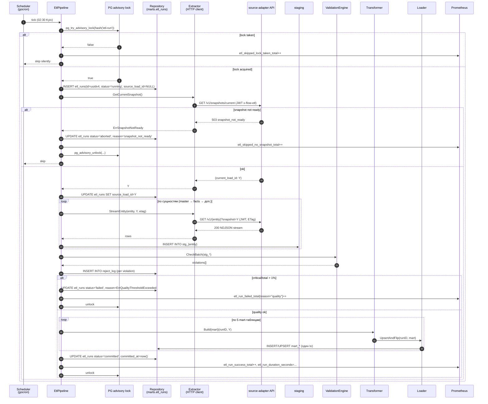
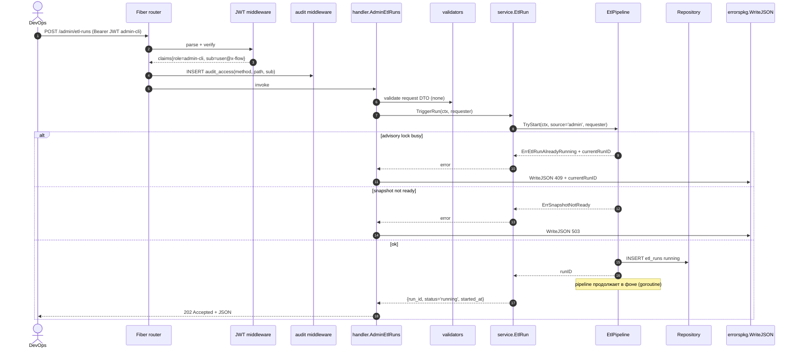
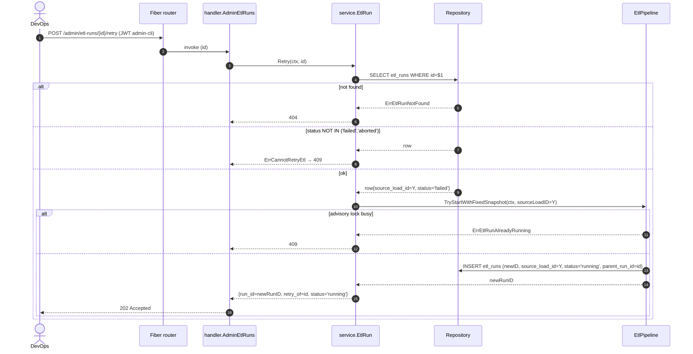
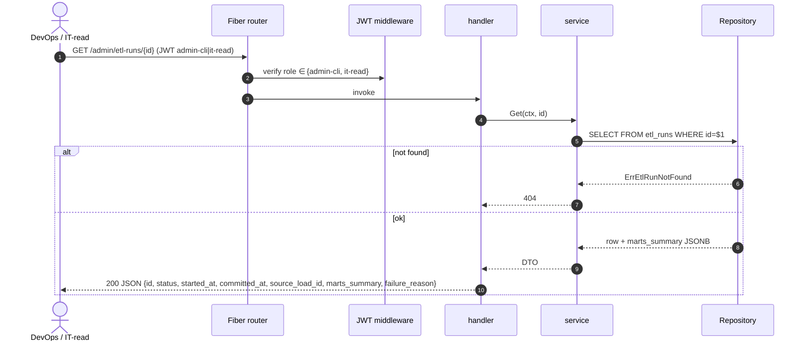
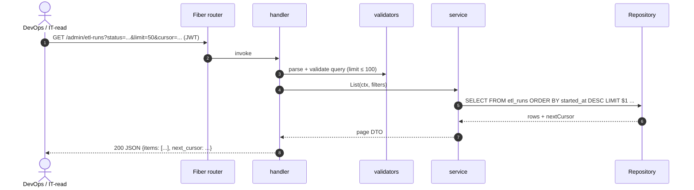
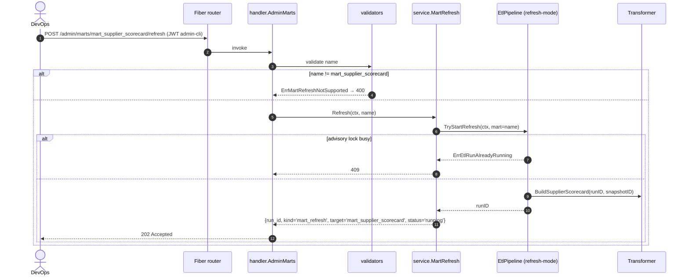
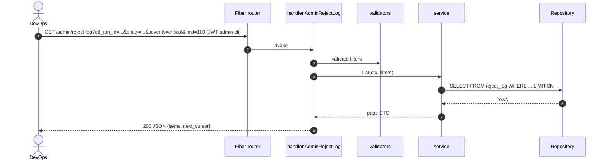
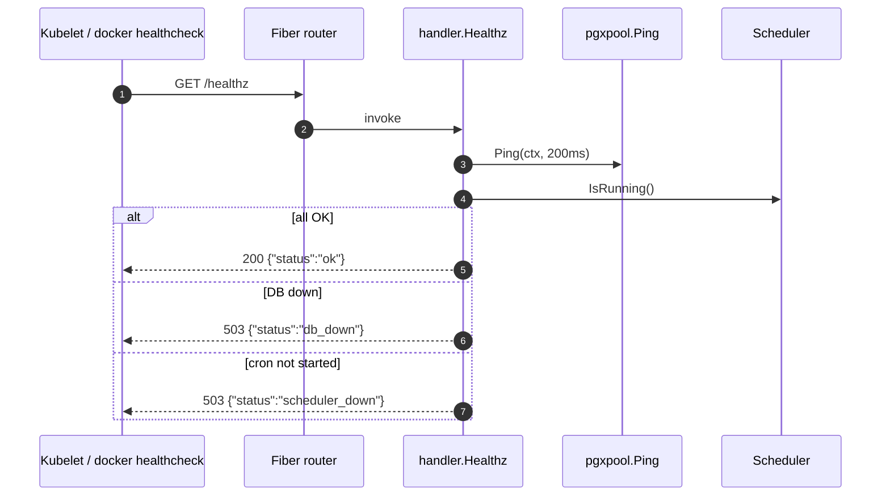

# Design Sequence Diagrams — etl-validation

Sequence-диаграммы для каждого endpoint + cron-tick.

---

## 0. Cron tick → ETL run (внутрипроцессный)

---

## 1. POST /admin/etl-runs (force start)

---

## 2. POST /admin/etl-runs/{id}/retry

---

## 3. GET /admin/etl-runs/{id}

---

## 4. GET /admin/etl-runs (пагинированный список)

---

## 5. POST /admin/marts/{name}/refresh

---

## 6. GET /admin/reject-log

---

## 7. GET /healthz

---

## 8. GET /metrics

Prometheus exposition. Никакой бизнес-логики; только `promhttp.Handler()` через Fiber adapter. Метрики защищены отдельным портом или basic-auth (см. [design-infrastructure.md](design-infrastructure.md)).
