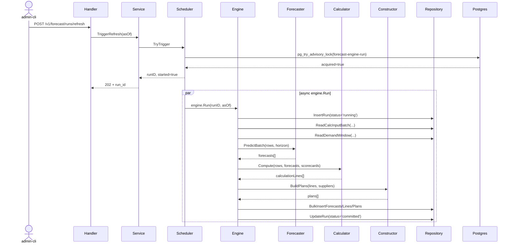

# Design: forecast-engine (Модуль 5)

**Дата:** 2026-05-07
**Mode:** compact (L-tier compressed)
**Tier:** L

## 1. Обзор + архитектура

Модуль 5 собирает прогноз спроса (Forecaster) → калькуляцию точек заказа (Calculator) → группировку и формирование плана пополнения (Constructor) → запись в `forecast.*`. Читает витрины `marts.*` напрямую из той же БД (pgxpool). Cron 05:00 Europe/Kyiv (после KPI 04:00).

### Архитектура (flow)

```
marts.mart_demand_history     ─┐
marts.mart_calculation_input  ─┤
marts.mart_supplier_scorecard ─┤── pgxpool ──> Repository.MartsReader
marts.mart_master_current     ─┘
                                                │
                                                ▼
                          ┌─────────── ForecastEngine.Run ───────────┐
                          │ 1. Forecaster.PredictBatch (SMA + season)│
                          │ 2. Calculator.Compute (RP, target, qty)  │
                          │ 3. Constructor.BuildPlans (group + MOQ)  │
                          └───────────────┬──────────────────────────┘
                                          ▼
                       forecast.forecast_runs / forecasts (partitioned) /
                       calculation_lines / replenishment_plans
                                          │
                                          ▼
                                       HTTP API (6 endpoints)
```

### Triage

```yaml
tier: L
touches: {db: true, fe: false, infra: false, external: false}
risk: data-migration
novelty: standard-crud
decisions: [forecaster-interface, partitioning-strategy, advisory-lock-key, run-orchestration, plan-approval-flow, calculation-formulas, constructor-grouping, scheduler-time]
```

## 2. Endpoints + DTO + Sequence

### 2.1. Список

| Метод | Путь | Роли | Описание |
|---|---|---|---|
| GET  | `/v1/forecast/runs` | read (it-read, x-flow-etl, admin-cli) | Список runs, фильтр `?status=&from=&to=&limit=&cursor=` |
| GET  | `/v1/forecast/runs/:id` | read | Один run + summary counters |
| POST | `/v1/forecast/runs/refresh` | admin-cli | Async recompute; 202 + run_id или 409 |
| GET  | `/v1/replenishment/plans` | read | Список планов; `?supplier_id=&location_id=&plan_date=&status=` |
| GET  | `/v1/replenishment/plans/:id` | read | План + lines |
| POST | `/v1/replenishment/plans/:id/approve` | admin-cli | draft → approved; 200 или 409 (если не draft) |

### 2.2. Sequence (refresh + плановый run)



## 3. SQL queries + миграции

### 3.1. Migration `3001_forecast_schema.up.sql`

```sql
CREATE SCHEMA IF NOT EXISTS forecast;

-- forecast_runs
CREATE TABLE IF NOT EXISTS forecast.forecast_runs (
    id              UUID PRIMARY KEY DEFAULT gen_random_uuid(),
    started_at      TIMESTAMPTZ NOT NULL DEFAULT now(),
    finished_at     TIMESTAMPTZ,
    status          TEXT NOT NULL CHECK (status IN ('running','committed','failed')),
    horizon_days    INTEGER NOT NULL DEFAULT 14,
    snapshot_etl_run_id UUID,
    forecasts_count INTEGER NOT NULL DEFAULT 0,
    lines_count     INTEGER NOT NULL DEFAULT 0,
    plans_count     INTEGER NOT NULL DEFAULT 0,
    error_message   TEXT,
    created_at      TIMESTAMPTZ NOT NULL DEFAULT now()
);
CREATE INDEX IF NOT EXISTS idx_forecast_runs_started ON forecast.forecast_runs(started_at DESC);

-- forecasts (partitioned monthly by forecast_date)
CREATE TABLE IF NOT EXISTS forecast.forecasts (
    run_id          UUID NOT NULL REFERENCES forecast.forecast_runs(id) ON DELETE CASCADE,
    product_id      TEXT NOT NULL,
    location_id     TEXT NOT NULL,
    forecast_date   DATE NOT NULL,
    forecast_qty    NUMERIC(18,4) NOT NULL,
    lower_bound     NUMERIC(18,4),
    upper_bound     NUMERIC(18,4),
    model_name      TEXT NOT NULL DEFAULT 'sma_seasonal',
    confidence      NUMERIC(5,4),
    created_at      TIMESTAMPTZ NOT NULL DEFAULT now(),
    PRIMARY KEY (run_id, product_id, location_id, forecast_date)
) PARTITION BY RANGE (forecast_date);

CREATE TABLE IF NOT EXISTS forecast.forecasts_2026_05 PARTITION OF forecast.forecasts
    FOR VALUES FROM ('2026-05-01') TO ('2026-06-01');
CREATE TABLE IF NOT EXISTS forecast.forecasts_2026_06 PARTITION OF forecast.forecasts
    FOR VALUES FROM ('2026-06-01') TO ('2026-07-01');
CREATE TABLE IF NOT EXISTS forecast.forecasts_2026_07 PARTITION OF forecast.forecasts
    FOR VALUES FROM ('2026-07-01') TO ('2026-08-01');
CREATE INDEX IF NOT EXISTS idx_forecasts_run ON forecast.forecasts(run_id);
CREATE INDEX IF NOT EXISTS idx_forecasts_pl ON forecast.forecasts(product_id, location_id, forecast_date);

-- calculation_lines
CREATE TABLE IF NOT EXISTS forecast.calculation_lines (
    id              UUID PRIMARY KEY DEFAULT gen_random_uuid(),
    run_id          UUID NOT NULL REFERENCES forecast.forecast_runs(id) ON DELETE CASCADE,
    product_id      TEXT NOT NULL,
    location_id     TEXT NOT NULL,
    supplier_id     TEXT,
    current_stock   NUMERIC(18,4) NOT NULL,
    in_transit      NUMERIC(18,4) NOT NULL DEFAULT 0,
    daily_demand    NUMERIC(18,4) NOT NULL,
    lead_time_days  INTEGER NOT NULL DEFAULT 7,
    safety_stock    NUMERIC(18,4) NOT NULL,
    reorder_point   NUMERIC(18,4) NOT NULL,
    target_stock    NUMERIC(18,4) NOT NULL,
    reorder_qty     NUMERIC(18,4) NOT NULL,
    calculated_at   TIMESTAMPTZ NOT NULL DEFAULT now(),
    UNIQUE (run_id, product_id, location_id)
);
CREATE INDEX IF NOT EXISTS idx_calc_lines_run ON forecast.calculation_lines(run_id);
CREATE INDEX IF NOT EXISTS idx_calc_lines_supplier ON forecast.calculation_lines(supplier_id);

-- replenishment_plans
CREATE TABLE IF NOT EXISTS forecast.replenishment_plans (
    id              UUID PRIMARY KEY DEFAULT gen_random_uuid(),
    run_id          UUID NOT NULL REFERENCES forecast.forecast_runs(id) ON DELETE CASCADE,
    supplier_id     TEXT NOT NULL,
    location_id     TEXT NOT NULL,
    plan_date       DATE NOT NULL,
    total_qty       NUMERIC(18,4) NOT NULL,
    lines_count     INTEGER NOT NULL,
    status          TEXT NOT NULL DEFAULT 'draft' CHECK (status IN ('draft','approved','cancelled')),
    approved_at     TIMESTAMPTZ,
    approved_by     TEXT,
    created_at      TIMESTAMPTZ NOT NULL DEFAULT now()
);
CREATE INDEX IF NOT EXISTS idx_plans_run ON forecast.replenishment_plans(run_id);
CREATE INDEX IF NOT EXISTS idx_plans_supplier_date ON forecast.replenishment_plans(supplier_id, plan_date);
CREATE INDEX IF NOT EXISTS idx_plans_status ON forecast.replenishment_plans(status);
```

### 3.2. Queries (go:embed в `internal/features/forecast/sqls/queries/`)

- `insert_run.sql` / `update_run_committed.sql` / `update_run_failed.sql`
- `select_run_by_id.sql` / `select_runs.sql`
- `bulk_insert_forecasts.sql` / `bulk_insert_calc_lines.sql` / `bulk_insert_plans.sql`
- `select_plans.sql` / `select_plan_with_lines.sql`
- `update_plan_approve.sql`
- `read_calc_input.sql` (marts) / `read_demand_window.sql` (marts) / `read_supplier_scorecard.sql` (marts)

## 4. Errors (новые sentinel'ы)

| Sentinel | HTTP | SupportMessage | Условие |
|---|---|---|---|
| `ErrForecastRunNotFound` | 404 | `FCT-001` | GET run/:id отсутствует |
| `ErrForecastRunInProgress` | 409 | `FCT-002` | Refresh при busy advisory lock |
| `ErrPlanNotFound` | 404 | `FCT-003` | GET plan/:id отсутствует |
| `ErrPlanNotDraft` | 409 | `FCT-004` | approve/cancel при status != 'draft' |
| `ErrInvalidHorizon` | 400 | `FCT-005` | horizon_days вне [1, 60] |
| `ErrInvalidPlanStatus` | 400 | `FCT-006` | invalid `?status=` query |
| `ErrForecastSchedulerUnavailable` | 503 | `FCT-007` | Scheduler не проинициализирован |

## 5. Tests

### Unit

- `forecaster/moving_average_test.go` — SMA-only (без сезонности), SMA + DOW multiplier, edge: <30 дней истории → fallback last_known
- `calculator/calculator_test.go` — reorder_point, safety_stock, target, qty (+already_on_order subtracts), edge: zero demand → qty=0
- `constructor/constructor_test.go` — group by supplier, MOQ filter, multiplier rounding
- `engine/engine_test.go` — happy path (read marts → 3 runs persisted), edge: empty marts → run committed with 0 forecasts

### Integration

- `repository/repository_integration_test.go` — `postgres:18-alpine`; миграция 3001 + минимальная `marts.*`; bulk insert correctness, FK cascade, partition routing

## 6. ADR (8 шт.)

### ADR-001: pluggable Forecaster interface
**Driver:** Q-002 — будущая ML-замена не должна ломать engine.
**Решение:** `type Forecaster interface { PredictBatch(ctx, rows []DemandSeries, horizon int) ([]Forecast, error) }`.
**Альтернативы:** жёстко SMA в engine — отвергнуто (vendor-lock); strategy plugin via reflection — overkill.

### ADR-002: SMA+seasonality для MVP
**Driver:** spec §8.1, MAPE-калибровка post-launch.
**Решение:** `forecast(d) = SMA30 × DOW × WOY`. WOY=1.0 при <4 сезонов истории.
**Альтернативы:** Prophet/LightGBM — другой стек; отложено до v2.

### ADR-003: partitioning forecasts по forecast_date RANGE month
**Driver:** ретеншн 365д + быстрый prune.
**Решение:** RANGE monthly partitions; стартовые 3 партиции в миграции.
**Альтернативы:** RANGE by run_id — труднее retention; LIST — нерасширяемо.

### ADR-004: advisory_lock key = `0x4643544552474E45` ("FCTERGNE")
**Driver:** идемпотентность параллельных runs (как в KPI).
**Решение:** константа `AdvisoryLockKey int64`.
**Альтернативы:** строковый lock через hash — добавляет round-trip.

### ADR-005: Read marts напрямую через pgxpool
**Driver:** Q-007, та же БД.
**Решение:** Repository.MartsReader использует тот же pool; latest committed `marts.etl_runs.id` как snapshot_etl_run_id.
**Альтернативы:** HTTP к data-marts API — лишний overhead, та же БД.

### ADR-006: Plan approval workflow draft → approved
**Driver:** Q-004, Module 6 hand-off.
**Решение:** статусы `draft|approved|cancelled`; approve через POST `/plans/:id/approve` (admin-cli).
**Альтернативы:** автоматический approve по threshold — небезопасно для MVP.

### ADR-007: Constructor MOQ + multiplier
**Driver:** §8.2 (econ_order_qty + min_max).
**Решение:** group by supplier, фильтр `total_qty < MOQ` skip; round up via multiplier.
**Альтернативы:** LP/knapsack — overkill для MVP; greedy достаточен.

### ADR-008: Cron 05:00 Europe/Kyiv (после KPI 04:00)
**Driver:** Q-001, dependency на свежие KPI calibrations.
**Решение:** `FORECAST_CRON_SCHEDULE=0 5 * * *`, configurable.
**Альтернативы:** event-driven trigger — спецификация явно отклонила (§9, реактивный расчёт).
