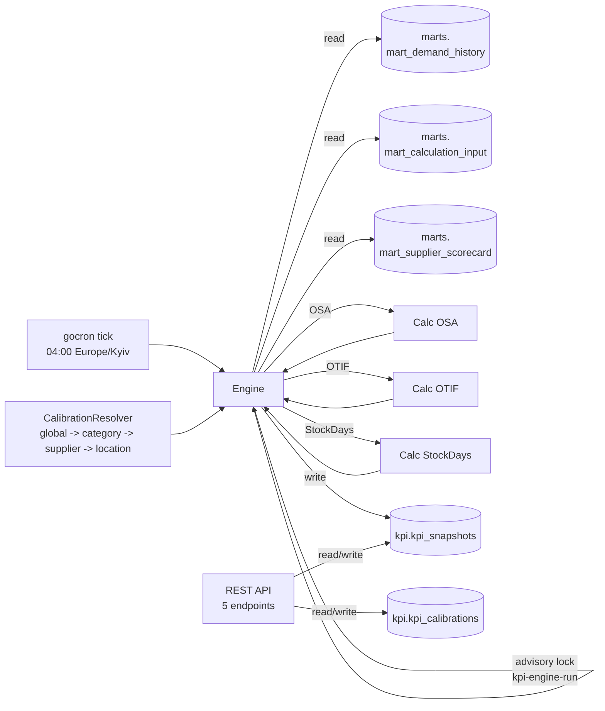

# Design: kpi-calibration (Модуль 4)

```yaml
# Triage
tier: M
touches: {db: true, fe: false, infra: false, external: false}
risk: reversible
novelty: standard-crud
decisions: [Q-001..Q-007]
```

## 1. Обзор

Модуль 4 — KPI engine, который ежедневно считает три KPI на основании mart-таблиц и записывает snapshot'ы в schema `kpi`.

### KPI definitions

**OSA (On-Shelf Availability)** — доля времени, когда товар доступен на полке.

```
OSA(product, location, date) = 1 - days_was_oos / total_observed_days
                                в окне 30 дней до as_of_date
                                на основании mart_demand_history.was_oos
```

Калибровка `osa`:
- `lookback_days` (default 30) — окно агрегации
- `min_observations` (default 7) — минимум дней наблюдения; меньше → пропустить
- `was_oos_threshold_qty` (default null) — если задано, пересчитывает was_oos через qty < threshold

**OTIF (On-Time In-Full)** — доля поставок, доставленных в срок и в полном объёме.

```
OTIF(supplier, week_start) = 1 - (lines_late + lines_short) / lines_delivered
                              из mart_supplier_scorecard
```

Калибровка `otif`:
- `late_grace_hours` (default 0) — допустимое опоздание
- `fill_rate_threshold` (default 0.95) — порог для fill_rate, ниже которого считается short

**Stock Days** — на сколько дней хватит остатков при текущей скорости продаж.

```
stock_days(product, location) = (on_hand + in_transit) / max(daily_demand, eps)
                                из mart_calculation_input
                                eps = 0.001 (защита от деления на 0)
```

Калибровка `stock_days`:
- `include_in_transit` (default true)
- `min_daily_demand` (default 0.001) — eps для деления
- `cap_days` (default 365) — верхняя граница

### Quality threshold

Если на этапе расчёта KPI количество rows с ошибками превышает 5% от общего числа кандидатов → run помечается failed, alert через scheduler tick metric.

## 2. Architecture



Layered: handler → service → engine/calculators/calibration → repository → pgx.

## 3. Endpoints

Все endpoints в группе `/v1/kpi/*` под middleware:
- `JWT` обязателен
- `GET /snapshots*` и `GET /calibrations*` — `RequireAnyOf(RoleITRead, RoleAdminCLI, RoleXFlowETL)`
- `PUT /calibrations/:id` и `POST /snapshots/refresh` — `RequireRole(RoleAdminCLI)`

| Method | Path | Action | Role |
|---|---|---|---|
| GET | `/v1/kpi/snapshots` | List snapshots | read |
| GET | `/v1/kpi/snapshots/:id` | Get snapshot by id | read |
| GET | `/v1/kpi/calibrations` | List calibrations | read |
| PUT | `/v1/kpi/calibrations/:id` | Update calibration params | admin-cli |
| POST | `/v1/kpi/snapshots/refresh` | Trigger ondemand recompute | admin-cli |

### DTOs

```go
// dto.SnapshotItem
type SnapshotItem struct {
    ID            uuid.UUID       `json:"id"`
    AsOfDate      string          `json:"as_of_date"`     // YYYY-MM-DD
    KpiName       string          `json:"kpi_name"`        // enums:"osa,otif,stock_days"
    ScopeType     string          `json:"scope_type"`      // enums:"global,category,supplier,location,product_location"
    ScopeID       *string         `json:"scope_id,omitempty"`
    Value         float64         `json:"value"`
    CalibrationID *uuid.UUID      `json:"calibration_id,omitempty"`
    ComputedAt    time.Time       `json:"computed_at"`
    EtlRunID      *uuid.UUID      `json:"etl_run_id,omitempty"`
}

// dto.ListSnapshotsResponse
type ListSnapshotsResponse struct {
    Items      []SnapshotItem `json:"items"`
    NextCursor string         `json:"next_cursor,omitempty"`
}

// query: ?as_of_date=YYYY-MM-DD&kpi_name=osa&scope_type=location&scope_id=...&limit=...&cursor=...

// dto.CalibrationItem
type CalibrationItem struct {
    ID        uuid.UUID       `json:"id"`
    KpiName   string          `json:"kpi_name"`
    ScopeType string          `json:"scope_type"`
    ScopeID   *string         `json:"scope_id,omitempty"`
    Params    json.RawMessage `json:"params"` // jsonb
    CreatedAt time.Time       `json:"created_at"`
    UpdatedAt time.Time       `json:"updated_at"`
}

// dto.UpdateCalibrationRequest
type UpdateCalibrationRequest struct {
    Params json.RawMessage `json:"params"` // jsonb, validation: not empty object
}

// dto.RefreshSnapshotsRequest (POST body — оба поля optional)
type RefreshSnapshotsRequest struct {
    FromDate *string  `json:"from_date,omitempty"` // YYYY-MM-DD; null => today
    KpiNames []string `json:"kpi_names,omitempty"` // null => all three
}

// dto.RefreshSnapshotsResponse
type RefreshSnapshotsResponse struct {
    RunID      uuid.UUID `json:"run_id"`
    Started    bool      `json:"started"`
    KpiNames   []string  `json:"kpi_names"`
    FromDate   string    `json:"from_date"`
}
```

## 4. SQL queries (go:embed) + миграция

### Migration 2001_kpi_schema.up.sql

```sql
CREATE SCHEMA IF NOT EXISTS kpi;

-- kpi_calibrations: hierarchy by (kpi_name, scope_type, scope_id)
CREATE TABLE IF NOT EXISTS kpi.kpi_calibrations (
    id          UUID PRIMARY KEY DEFAULT gen_random_uuid(),
    kpi_name    TEXT NOT NULL,
    scope_type  TEXT NOT NULL CHECK (scope_type IN ('global','category','supplier','location','product_location')),
    scope_id    TEXT,                       -- null = global
    params      JSONB NOT NULL DEFAULT '{}'::jsonb,
    created_at  TIMESTAMPTZ NOT NULL DEFAULT now(),
    updated_at  TIMESTAMPTZ NOT NULL DEFAULT now()
);

-- Уникальность (kpi_name, scope_type, scope_id) — учитываем NULL для global
CREATE UNIQUE INDEX IF NOT EXISTS uq_kpi_calibrations_scope
    ON kpi.kpi_calibrations (kpi_name, scope_type, COALESCE(scope_id, ''));

-- kpi_snapshots: партиционирована по as_of_date месячно
CREATE TABLE IF NOT EXISTS kpi.kpi_snapshots (
    id              UUID NOT NULL DEFAULT gen_random_uuid(),
    as_of_date      DATE NOT NULL,
    kpi_name        TEXT NOT NULL,
    scope_type      TEXT NOT NULL CHECK (scope_type IN ('global','category','supplier','location','product_location')),
    scope_id        TEXT,
    value           NUMERIC(18,6) NOT NULL,
    calibration_id  UUID REFERENCES kpi.kpi_calibrations(id) ON DELETE SET NULL,
    computed_at     TIMESTAMPTZ NOT NULL DEFAULT now(),
    etl_run_id      UUID,
    created_at      TIMESTAMPTZ NOT NULL DEFAULT now(),
    PRIMARY KEY (id, as_of_date)
) PARTITION BY RANGE (as_of_date);

CREATE TABLE IF NOT EXISTS kpi.kpi_snapshots_2026_05 PARTITION OF kpi.kpi_snapshots
    FOR VALUES FROM ('2026-05-01') TO ('2026-06-01');
CREATE TABLE IF NOT EXISTS kpi.kpi_snapshots_2026_06 PARTITION OF kpi.kpi_snapshots
    FOR VALUES FROM ('2026-06-01') TO ('2026-07-01');

CREATE INDEX IF NOT EXISTS idx_kpi_snapshots_filter
    ON kpi.kpi_snapshots (as_of_date, kpi_name, scope_type);

-- Сидинг дефолтных global калибровок для трёх KPI
INSERT INTO kpi.kpi_calibrations (kpi_name, scope_type, scope_id, params) VALUES
    ('osa',         'global', NULL, '{"lookback_days":30,"min_observations":7}'::jsonb),
    ('otif',        'global', NULL, '{"late_grace_hours":0,"fill_rate_threshold":0.95}'::jsonb),
    ('stock_days',  'global', NULL, '{"include_in_transit":true,"min_daily_demand":0.001,"cap_days":365}'::jsonb)
ON CONFLICT DO NOTHING;
```

### sqls/queries/*.sql (go:embed)

Файлы:
- `select_demand_history_for_osa.sql` — SELECT product_id, location_id, count(*), sum(was_oos::int) FROM marts.mart_demand_history WHERE as_of_date BETWEEN $1 AND $2 GROUP BY product_id, location_id
- `select_calc_input_for_stock_days.sql` — SELECT product_id, location_id, on_hand, in_transit, daily_demand, supplier_id FROM marts.mart_calculation_input
- `select_supplier_scorecard_for_otif.sql` — SELECT supplier_id, week_start, lines_delivered, lines_late, qty_short_total FROM marts.mart_supplier_scorecard WHERE week_start BETWEEN $1 AND $2
- `insert_snapshot.sql` — INSERT INTO kpi.kpi_snapshots (...) VALUES (...)
- `select_snapshots.sql` — SELECT с фильтрами + cursor pagination
- `select_snapshot_by_id.sql` — SELECT WHERE id = $1
- `select_calibrations.sql` — SELECT с опц. фильтром по kpi_name
- `update_calibration.sql` — UPDATE kpi.kpi_calibrations SET params=$2, updated_at=now() WHERE id=$1
- `delete_snapshots_for_refresh.sql` — DELETE WHERE as_of_date=$1 AND kpi_name=ANY($2)

## 5. Errors

Новые sentinel-errors в `pkg/errorspkg/errors.go`:

```go
ErrKpiSnapshotNotFound = &Error{
    Code: "kpi_snapshot_not_found",
    Message: "kpi snapshot not found",
    SupportMessage: SupportKpiSnapshotNotFound, // "KPI-001"
    HTTP: http.StatusNotFound,
}
ErrKpiCalibrationNotFound = &Error{
    Code: "kpi_calibration_not_found",
    Message: "kpi calibration not found",
    SupportMessage: SupportKpiCalibrationNotFound, // "KPI-002"
    HTTP: http.StatusNotFound,
}
ErrInvalidKpiName = &Error{
    Code: "invalid_kpi_name",
    Message: "invalid kpi name",
    SupportMessage: SupportInvalidKpiName, // "KPI-003"
    HTTP: http.StatusBadRequest,
}
```

Support-коды:
- `SupportKpiSnapshotNotFound = "KPI-001"`
- `SupportKpiCalibrationNotFound = "KPI-002"`
- `SupportInvalidKpiName = "KPI-003"`

## 6. Tests

| Слой | Тип | Покрытие |
|---|---|---|
| `calculators/osa.go` | unit | happy + division-by-zero (no observations) + min_observations gate |
| `calculators/otif.go` | unit | happy + zero deliveries + late_grace_hours behaviour |
| `calculators/stock_days.go` | unit | happy + zero daily_demand (eps) + include_in_transit toggle |
| `calibration/resolver.go` | unit | resolution priority: location > supplier > category > global; fallback chain |
| `repository` | integration (dockertest postgres:18-alpine) | CRUD snapshots/calibrations + migration apply |
| `service` | unit (mock repo) | List/Get/Update/Refresh delegation |
| `engine/engine.go` | unit (mock repo + mock readers) | quality threshold (>5% errors → fail) |
| `handler` | unit | 5 endpoints; happy + 400 + 404 |

## 7. ADR (7 шт)

**ADR-001 (Q-001) Cron 04:00 Europe/Kyiv.** ETL завершается в 02:30, mart обновлён к 03:00; запас 1 час. Configurable через `KPI_CRON_SCHEDULE`.

**ADR-002 (Q-002) Чтение marts напрямую через pgxpool.** Тот же пул, что у data_export/marts. Нет HTTP overhead и сериализации; HTTP `/v1/marts/:name` остаётся для внешних потребителей. Отказ от HTTP оправдан тем, что KPI engine — internal compute, in-process с marts.

**ADR-003 (Q-003) Hierarchy resolution: location > supplier > category > global.** Resolver идёт от конкретного к generic. Один scope — один матч. Это даёт детерминированную математику и отсутствие конфликтов merge.

**ADR-004 (Q-004) Retention 365d.** Партиции kpi_snapshots дропаются раз в месяц cleanup-ом (вне MVP, в backlog). На 365 дней x 5 scope-types x 3 KPI ~ 25K rows/scope — приемлемо.

**ADR-005 (Q-005) Партиционирование RANGE по as_of_date месячно.** Идентично mart_kpi_daily — drop старых месяцев = constant time. Стартовые партиции 2026-05/06; auto-create в backlog.

**ADR-006 (Q-006) Recompute past — manual via POST.** `POST /v1/kpi/snapshots/refresh` с `from_date`. Внутри: DELETE + INSERT за указанный диапазон. Защищён advisory-lock'ом, чтобы не пересекался с cron.

**ADR-007 (Q-007) Feature path internal/features/kpi/.** Встраивается в source-adapter binary. Reuse pgxpool, JWT, observability. Отдельный binary не нужен — compute light, IO-bound.

## 8. Tier-specific notes

- M-tier: design в одном файле + 1 Mermaid + Monitoring inline.
- Monitoring: метрики `kpi_engine_run_total{result}`, `kpi_engine_run_duration_seconds`, `kpi_snapshot_count_total{kpi_name}`, `kpi_engine_errors_total{kpi_name,reason}`. Алерт (deferred backlog): `kpi_engine_run_total{result="error"} > 0` за 1 час → page on-call.
- Rollback: `migrate-down-kpi` снимает schema kpi полностью. Безопасно, потому что schema независимая.
- Quality threshold: 5% error budget per run.
