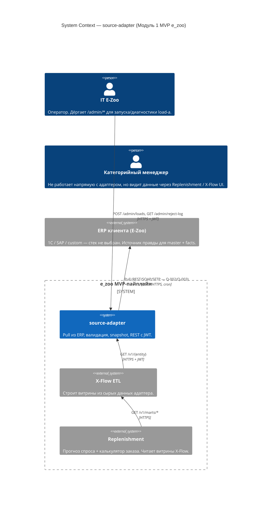
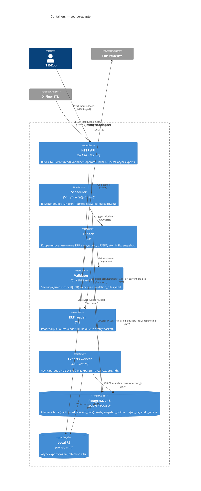
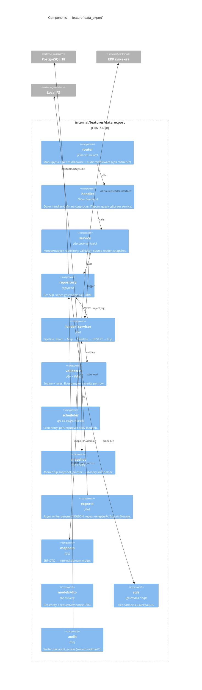
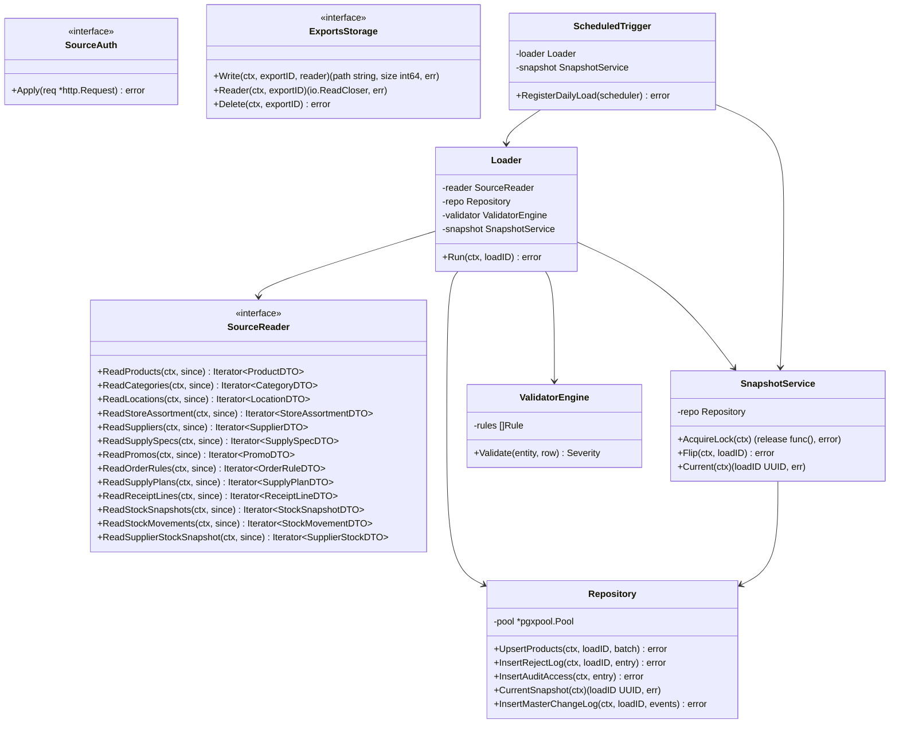

# Design C4 — source-adapter

C4-модель в 4 уровнях детализации (Mermaid). Уровни 3 и 4 ограничены фичей `data_export`.

---

## L1 — System Context

## L2 — Containers

## L3 — Components внутри `internal/features/data_export`

## L4 — Code (key types и связи)

## Граничные принципы

- **Один handler — один файл.** `handler/products.go`, `handler/admin_loads.go` и т.д.
- **Repository — единственный owner SQL.** Все строки SQL — через `go:embed`. Никаких inline-строк
  в service-слое.
- **Service ничего не знает о Fiber.** Принимает `context.Context` + типизированные args, возвращает
  domain-объекты или sentinel-ошибки.
- **Loader работает только через интерфейсы** — `SourceReader`, `Repository`, `ValidatorEngine`,
  `SnapshotService`. Это упрощает unit-тесты с моками.
