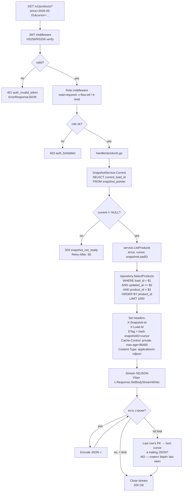

# Design Dataflow — source-adapter

Три потока данных:
1. Общий dataflow (cron → ERP → PG → consumer).
2. Детальный поток для **cron-load** (включая reject_log, snapshot flip, advisory lock).
3. Детальный поток для **GET /v1/{entity}** (включая JWT, snapshot binding, NDJSON streaming).

---

## 1. Общий dataflow

```mermaid
flowchart LR
  subgraph ERP[ERP клиента E-Zoo]
    erp_master[(master tables<br/>products, category,<br/>location, supplier...)]
    erp_facts[(facts<br/>receipt_line,<br/>stock_movement...)]
  end

  subgraph Adapter[source-adapter Go process]
    cron[Scheduler<br/>gocron tick]
    reader[SourceReader<br/>HTTP/SOAP/SFTP]
    validator[Validator<br/>severity engine]
    loader[Loader<br/>orchestrator]
    snapshot[SnapshotService<br/>atomic flip]
    api[Fiber v3 HTTP API]
    exports[Exports worker]
  end

  subgraph PG[(PostgreSQL 18)]
    pg_master[(master + facts<br/>partitioned by event_date)]
    pg_meta[(loads, snapshot_pointer,<br/>reject_log, audit_access,<br/>master_change_log)]
  end

  fs[/Local FS<br/>/var/exports/]
  consumer[X-Flow ETL<br/>/ IT E-Zoo<br/>/ Replenishment]

  cron -->|trigger daily-load| loader
  loader -->|Read{Entity}| reader
  reader -->|HTTPS pull| ERP
  reader -->|DTO batches| loader
  loader -->|Validate| validator
  validator -->|severity per row| loader
  loader -->|UPSERT valid| pg_master
  loader -->|INSERT critical| pg_meta
  loader -->|Flip snapshot_pointer| snapshot
  snapshot --> pg_meta

  consumer -->|GET /v1/{entity} + JWT| api
  api -->|SELECT WHERE load_id = current| pg_master
  api -->|NDJSON streaming| consumer
  consumer -->|POST /v1/exports| api
  api -->|enqueue| exports
  exports -->|SELECT batch| pg_master
  exports -->|Write parquet| fs
  consumer -->|GET /v1/exports/{id}| api
  api -->|Fiber static stream| fs
  api -->|INSERT audit_access<br/>only /admin/*| pg_meta
```

## 2. Детальный поток: cron-load

```mermaid
flowchart TD
  start([Cron tick<br/>02:00 Europe/Kyiv]) --> lock{PG advisory lock<br/>'daily-load' acquired?}
  lock -->|no, занят| skip[Лог: skip,<br/>другой инстанс работает<br/>метрика: load_skipped_total]
  lock -->|yes| ins_load[INSERT loads<br/>id=uuid, status='running',<br/>source='erp_e_zoo']

  ins_load --> entities_loop[Цикл по сущностям<br/>master сначала, затем facts]

  entities_loop --> read[SourceReader.Read{Entity}<br/>cursor-пагинация]
  read --> err_read{Сетевая ошибка<br/>или >max_retries?}
  err_read -->|yes| fail_load[UPDATE loads<br/>status='failed',<br/>finished_at=now]
  err_read -->|no| map[Mapper:<br/>ERP DTO → domain]

  map --> validate[ValidatorEngine.Validate]
  validate --> severity{severity?}
  severity -->|critical| reject[INSERT reject_log<br/>load_id, entity, pk, raw, reason]
  severity -->|soft| warn_metric[Метрика<br/>validation_soft_total]
  severity -->|ok / soft| upsert[UPSERT staging<br/>WHERE load_id = current_load]

  reject --> next_row[next row]
  warn_metric --> upsert
  upsert --> next_row
  next_row --> read

  read -->|конец сущности| change_log[Diff-detector<br/>tracked fields из YAML]
  change_log --> ins_change[INSERT master_change_log<br/>append-only]
  ins_change --> entities_loop

  entities_loop -->|все сущности| quality{lines_failed /<br/>lines_total > 1%?}
  quality -->|yes| fail_load
  quality -->|no| flip[BEGIN TX<br/>UPDATE snapshot_pointer<br/>SET previous = current,<br/>    current = load_id<br/>COMMIT]

  flip --> commit[UPDATE loads<br/>status='committed',<br/>finished_at=now,<br/>entities_summary=jsonb]

  commit --> release[Release advisory lock]
  fail_load --> release
  release --> metric[Метрика:<br/>load_success_total ИЛИ<br/>load_failed_total{reason}]
  metric --> done([Конец])
  skip --> done
```

### Ключевые гарантии

- **Atomic flip** — `snapshot_pointer` обновляется в одной транзакции, потребители всегда видят
  консистентный snapshot (либо старый, либо новый — никогда «полу-новый»).
- **No partial commits** — если хоть одна сущность fail (после исчерпания retry), весь load
  fail-ается; staging-строки «осиротевшего» load_id остаются в таблицах, но не видны
  потребителям (фильтр `load_id = current_load_id`). Cleanup — отдельный maintenance job (см.
  [design-sql.md](design-sql.md) §Cleanup).
- **Quality threshold** — `lines_failed / lines_total > 1%` ⇒ load failed (строже стандартного 5%
  из data-export-spec).
- **Advisory lock** — `pg_try_advisory_lock(hashtext('source-adapter:daily-load'))`. Не
  блокирующий: если занят — выходим без ошибки, метрика `load_skipped_total`.

## 3. Детальный поток: GET /v1/{entity}



### Ключевые гарантии

- **Snapshot binding на момент запроса.** `current_load_id` фиксируется один раз в начале
  обработки. Если в середине стрима произойдёт flip — клиент всё равно получит консистентный
  срез (фильтр уже привязан к старому `load_id`). Фактическая UPSERT-стратегия с
  `load_id = NEW_load_id` не затрагивает уже проиндексированные строки.
- **NDJSON streaming.** Не буферизуем весь ответ; пишем построчно через
  `c.Response().SetBodyStreamWriter`.
- **Cursor — опаковая строка.** Для master = последний `{entity}_id`. Для facts = композит
  `{event_date}|{event_time}|{pk}`.
- **ETag** = `sha256(snapshot_id + cursor)`. При совпадении If-None-Match → 304.
- **Audit НЕ пишется** для `/v1/*`. Только для `/admin/*` (см. ADR-008).

## 4. Поток async-export (>50 MB)

```mermaid
flowchart TD
  post[POST /v1/exports<br/>{entity, snapshot_id?, format=parquet}] --> jwt[JWT middleware]
  jwt --> svc[service.CreateExport]
  svc --> ins[INSERT exports<br/>id=uuid, status='queued',<br/>entity, snapshot_id, format]
  ins --> resp[202 Accepted<br/>{export_id}]

  bg[Background worker<br/>poll exports WHERE status='queued'] --> claim[UPDATE exports<br/>SET status='running'<br/>WHERE id=$1]
  claim --> select_rows[SELECT rows<br/>WHERE load_id = snapshot_id<br/>cursor batches]
  select_rows --> write[ExportsStorage.Write<br/>Local FS: /var/exports/{id}.parquet]
  write --> upd[UPDATE exports<br/>status='ready', size_bytes=N,<br/>path='/var/exports/{id}.parquet']

  get[GET /v1/exports/{id}] --> sel[SELECT exports WHERE id=$1]
  sel --> st{status?}
  st -->|queued/running| r1[200 {status, progress}]
  st -->|ready| r2[200 {status, download_url=/v1/exports/{id}/download, size_bytes}]
  st -->|failed| r3[500 {status, error}]

  dl[GET /v1/exports/{id}/download] --> static[Fiber static<br/>сервит /var/exports/{id}.parquet]
```
