# Design Sequence Diagrams — source-adapter

Sequence-диаграммы (Mermaid) для каждого endpoint + cron-tick. Сгруппированы по endpoint-семьям.

---

## 0. Cron tick → daily-load (внутрипроцессный)

```mermaid
sequenceDiagram
  autonumber
  participant Cron as Scheduler<br/>(gocron)
  participant Loader
  participant Lock as PG advisory lock
  participant Reader as SourceReader
  participant ERP
  participant Val as Validator
  participant Repo as Repository
  participant Snap as SnapshotService
  participant Metrics as Prometheus

  Cron->>Loader: Trigger daily-load (02:00 Kyiv)
  Loader->>Lock: pg_try_advisory_lock(hash('daily-load'))
  alt lock taken
    Lock-->>Loader: false
    Loader->>Metrics: load_skipped_total++
    Loader-->>Cron: skip silently
  else lock acquired
    Lock-->>Loader: true
    Loader->>Repo: INSERT loads(id, status='running')
    loop по сущностям (master → facts)
      Loader->>Reader: ReadX(ctx, since)
      Reader->>ERP: HTTPS pull (cursor)
      ERP-->>Reader: batch DTO
      Reader-->>Loader: domain rows
      Loader->>Val: Validate(entity, rows)
      Val-->>Loader: severity per row
      alt severity = critical
        Loader->>Repo: INSERT reject_log
      else
        Loader->>Repo: UPSERT staging<br/>(load_id = newID)
      end
    end
    Loader->>Repo: SELECT diff for master_change_log
    Loader->>Repo: INSERT master_change_log
    Loader->>Loader: lines_failed/lines_total > 1%?
    alt quality OK
      Loader->>Snap: Flip(loadID)
      Snap->>Repo: BEGIN; UPDATE snapshot_pointer; COMMIT
      Snap-->>Loader: ok
      Loader->>Repo: UPDATE loads(status='committed')
      Loader->>Metrics: load_success_total++
    else quality failed
      Loader->>Repo: UPDATE loads(status='failed', reason)
      Loader->>Metrics: load_failed_total{reason="quality"}++
    end
    Loader->>Lock: pg_advisory_unlock
  end
```

## 1. GET /v1/healthz

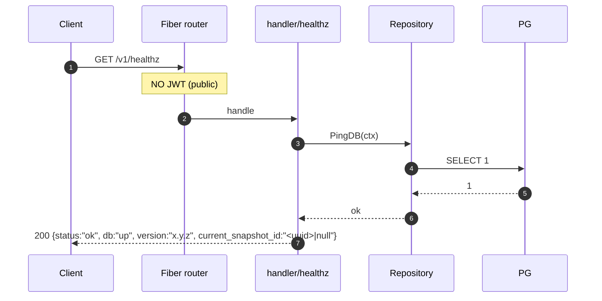

## 2. GET /v1/snapshots, GET /v1/snapshots/current

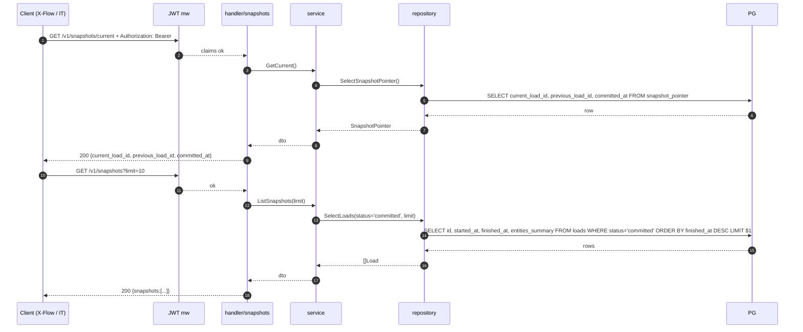

## 3. GET /v1/{master_entity} (products, product_barcodes, category, location, supplier)

> Шаблон одинаков для всех master-сущностей. Дальше показан `products`.

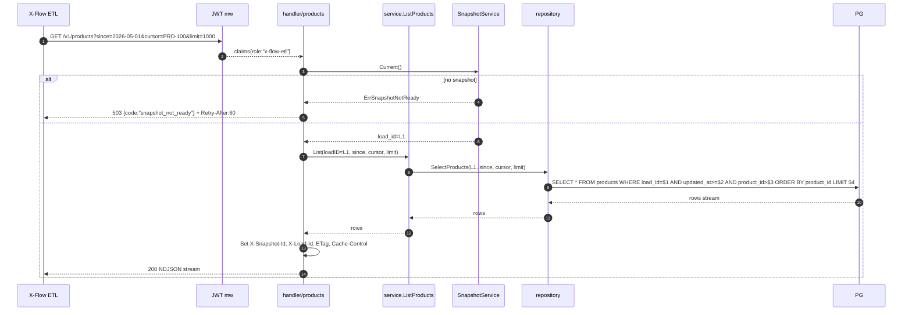

## 4. GET /v1/store_assortment, GET /v1/store_assortment/lifecycle_events

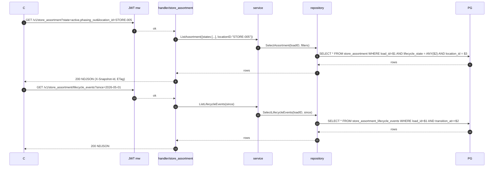

**Response payload (ADR-016 / Q-016) — `StoreAssortmentLifecycleEventResponse`:**

| Поле | Тип | Описание |
|---|---|---|
| `eventId` | UUID string | ID события lifecycle |
| `eventType` | enum | `started` \| `stopped` \| `promo_started` \| `promo_stopped` |
| `locationId` | string | ID точки (магазина/DC) |
| `productId` | string | ID товара |
| `effectiveAt` | timestamp | Когда событие вступило в силу |
| `reason` | string? | Например `out_of_stock`, `promo_id=PR123` |
| `promoId` | string? | Если `eventType` = `promo_*` |
| `priorState` | enum? | `active` \| `inactive` \| `promo` |
| `newState` | enum | `active` \| `inactive` \| `promo` |
| `sourceLoadId` | UUID string | ID загрузки, в которой обнаружено событие |
| `createdAt` | timestamp | Время записи в `master_change_log` адаптера |

JSON Schema: `additionalProperties: false`. Полное Go-определение — см.
[design-go-layers.md](design-go-layers.md) §3.1 `StoreAssortmentLifecycleEventResponse`.
```

## 5. GET /v1/master_change_log

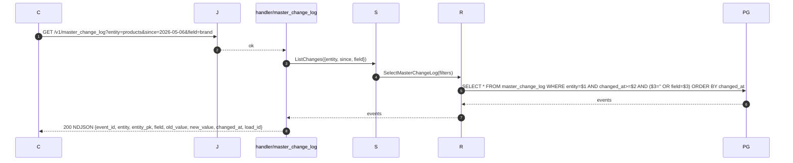

## 6. GET /v1/supplier_stock_snapshot

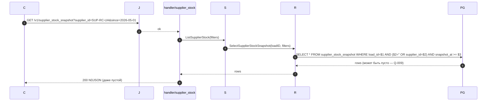

## 7. GET /v1/supply_spec, /v1/promo, /v1/supply_plan, /v1/order_rule

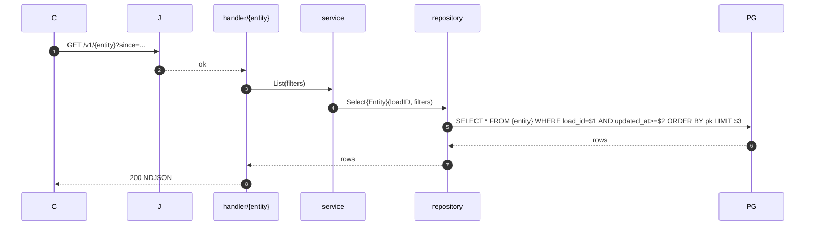

## 8. POST /v1/exports

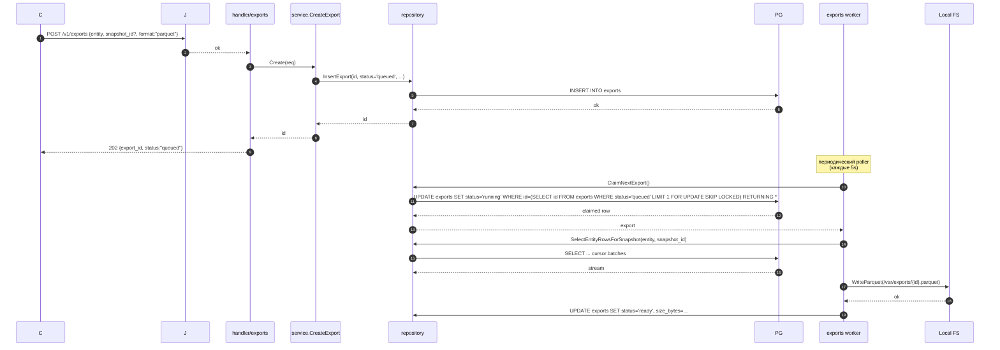

## 9. GET /v1/exports/{id}

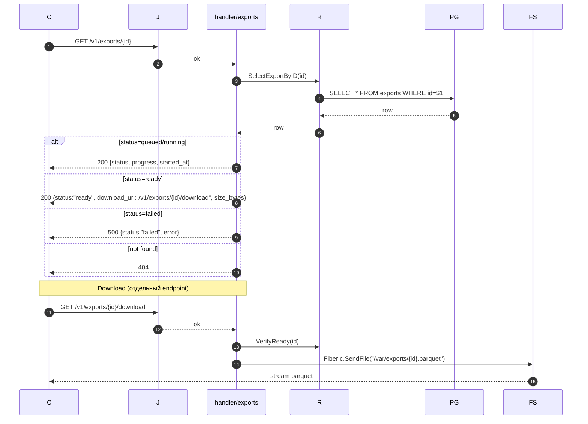

## 10. POST /admin/loads (manual trigger)

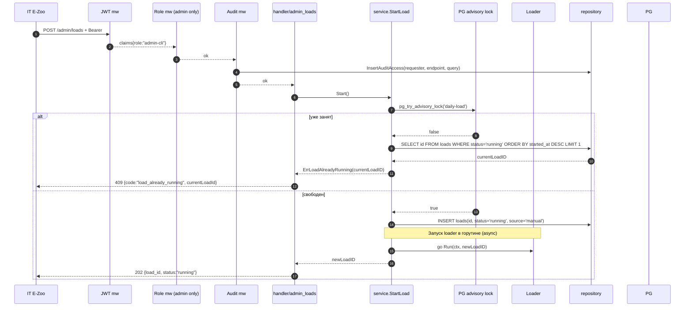

## 11. POST /admin/loads/{id}/retry

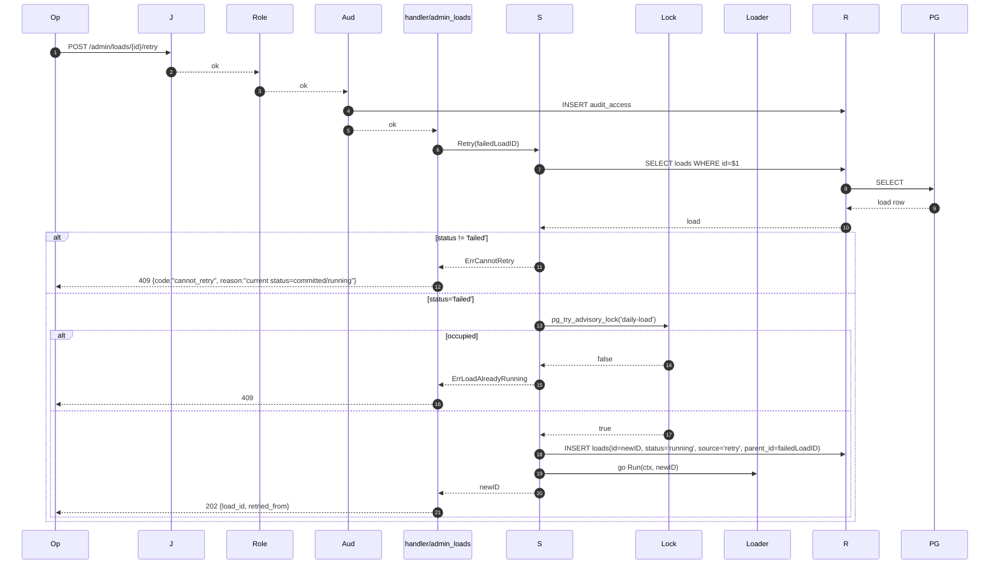

## 12. GET /admin/loads/{id}

```mermaid
sequenceDiagram
  autonumber
  participant Op
  participant J
  participant Role
  participant Aud
  participant H as handler/admin_loads
  participant S
  participant R
  participant PG

  Op->>J: GET /admin/loads/{id}
  J-->>Role-->>Aud: ok
  Aud->>R: INSERT audit_access
  H->>S: Get(id)
  S->>R: SelectLoadByID(id)
  R->>PG: SELECT * FROM loads WHERE id=$1
  PG-->>R: row
  R-->>S: load
  S->>R: CountRejectLog(loadID)
  R->>PG: SELECT entity, severity, count(*) FROM reject_log WHERE load_id=$1 GROUP BY ...
  PG-->>R: summary
  R-->>S: rejectSummary
  S-->>H: dto
  H-->>Op: 200 {load_id, status, started_at, finished_at, entities_summary, reject_summary}
```

## 13. GET /admin/reject-log

```mermaid
sequenceDiagram
  autonumber
  participant Op
  participant J
  participant Role
  participant Aud
  participant H as handler/admin_reject_log
  participant S
  participant R
  participant PG

  Op->>J: GET /admin/reject-log?load_id=...&entity=...&limit=500
  J-->>Role-->>Aud: ok
  Aud->>R: INSERT audit_access
  H->>S: List(filters)
  S->>R: SelectRejectLog(filters)
  R->>PG: SELECT * FROM reject_log WHERE load_id=$1 AND ($2='' OR entity=$2) ORDER BY detected_at LIMIT $3
  PG-->>R: rows
  R-->>S: rows
  S-->>H: dto
  H-->>Op: 200 NDJSON {load_id, entity, pk_value, severity, reason, raw, detected_at}
```
